> Open the jupyter notebook `rueegg_wissiak.ipynb` for a better reading experience.

Made with ♥ by Thomas Rüegg and Patrick Wissiak

# Introduction

In this Jupyter Notebook, we'll introduce a convolutional neural network that is underfitting, then, create a new model that will overfit to the training data. Since that will not be the desired behavior, we'll showcase various methods to defeat overfitting, resulting in a model that'll be optimal. We'll discuss learnings and wrap everything up with a summary and an outlook.

# General Information

## Environment Setup

With `environment.yml` we're providing our environment yaml file to use the same environment as we did to run the project.

## The Dataset

We used [this dataset from kaggle](https://www.kaggle.com/datasets/puneet6060/intel-image-classification) for our miniproject.

The dataset contains 6 classes of images: `building`, `forest`, `glacier`, `mountain`, `sea`, and `street`. We decided to delete the class `street` and it's corresponding pictures to simplify the learning process. The images are divided into folders with their respective labels. We used the `image_dataset_from_directory` method of Keras to convert the images into a TensorFlow dataset object for training.

The dataset fulfills all of the requirements posed in the assignment:

- from 4 to 15 classes (had 6, now 5) ✓
- minimum of 500 samples per class (has ~2300) ✓
- less than 150k samples in total (has 24.3k) ✓

## Importing the Data

```python
import numpy as np
import matplotlib.pyplot as plt
from tensorflow.python.client import device_lib
from sklearn import metrics

print(device_lib.list_local_devices())
```

    [name: "/device:CPU:0"
    device_type: "CPU"
    memory_limit: 268435456
    locality {
    }
    incarnation: 8524786519451901098
    xla_global_id: -1
    , name: "/device:GPU:0"
    device_type: "GPU"
    locality {
      bus_id: 1
    }
    incarnation: 6661481412842572621
    physical_device_desc: "device: 0, name: METAL, pci bus id: <undefined>"
    xla_global_id: -1
    ]Metal device set to: Apple M2 Pro

    systemMemory: 16.00 GB
    maxCacheSize: 5.33 GB


    2023-03-18 17:24:47.130228: I tensorflow/core/common_runtime/pluggable_device/pluggable_device_factory.cc:305] Could not identify NUMA node of platform GPU ID 0, defaulting to 0. Your kernel may not have been built with NUMA support.
    2023-03-18 17:24:47.130404: I tensorflow/core/common_runtime/pluggable_device/pluggable_device_factory.cc:271] Created TensorFlow device (/device:GPU:0 with 0 MB memory) -> physical PluggableDevice (device: 0, name: METAL, pci bus id: <undefined>)

```python
from tensorflow.keras.utils import image_dataset_from_directory
training_img_path = "./dataset/seg_train/seg_train/"

img_size = 150
seed = 42   # the seed will make sure the two datasets are not overlapping

def import_datasets(batch_size=16):
    train_ds = image_dataset_from_directory(
        './dataset/seg_train/seg_train',
        validation_split=0.2,
        subset="training",
        labels="inferred",
        seed=seed,
        image_size=(img_size, img_size),
        batch_size=batch_size
    )
    val_ds = image_dataset_from_directory(
        './dataset/seg_train/seg_train',
        validation_split=0.2,
        subset="validation",
        labels="inferred",
        seed=seed,
        image_size=(img_size, img_size),
        batch_size=batch_size
    )
    test_ds = image_dataset_from_directory(
        './dataset/seg_test/seg_test',
        labels="inferred",
        seed=seed,
        image_size=(img_size, img_size),
        batch_size=batch_size
    )
    return train_ds, val_ds, test_ds
train_ds, val_ds, test_ds = import_datasets()

ds = test_ds.unbatch()
ds = list(ds.as_numpy_iterator())
test_images = [x for x, y in ds]
test_labels = [y for x, y in ds]


full_train_dataset = image_dataset_from_directory(
    './dataset/seg_train/seg_train',
    seed=seed,
    image_size=(img_size, img_size)
)

ds = full_train_dataset.unbatch()
ds = list(ds.as_numpy_iterator())
train_images = np.array([x for x, y in ds])
train_labels = np.array([y for x, y in ds])
```

    Found 2666 files belonging to 5 classes.
    Using 2133 files for training.
    Found 2666 files belonging to 5 classes.
    Using 533 files for validation.


    2023-03-18 17:24:49.552234: I tensorflow/core/common_runtime/pluggable_device/pluggable_device_factory.cc:305] Could not identify NUMA node of platform GPU ID 0, defaulting to 0. Your kernel may not have been built with NUMA support.
    2023-03-18 17:24:49.552263: I tensorflow/core/common_runtime/pluggable_device/pluggable_device_factory.cc:271] Created TensorFlow device (/job:localhost/replica:0/task:0/device:GPU:0 with 0 MB memory) -> physical PluggableDevice (device: 0, name: METAL, pci bus id: <undefined>)


    Found 2499 files belonging to 5 classes.


    2023-03-18 17:24:49.820297: W tensorflow/core/platform/profile_utils/cpu_utils.cc:128] Failed to get CPU frequency: 0 Hz


    Found 2666 files belonging to 5 classes.

## Common functionalities

Here we define functions that we will need in later sections of the notebook.

This code handles the data augmentation which can be added to the beginning of a model. As data augmentation we use flipping as well as zooming and rotating both with a percentage of 0.1.

```python
from tensorflow.keras.models import Sequential
from tensorflow.keras.layers import RandomRotation, RandomZoom, RandomFlip

data_augmentation = Sequential(
  [
    RandomFlip("horizontal", input_shape=(img_size, img_size, 3)),
    RandomRotation(0.1),
    RandomZoom(0.1),
  ]
)
```

The below function shows sample images from the dataset and can apply data augmentation if activated per parameter.

```python
def show_images(title, augment = False):
  plt.figure(figsize=(5, 5))
  plt.suptitle(title)

  for i in range(9):
    if augment:
      # Convert to shape with batch for prediction
      img = np.reshape(test_images[i], (1, img_size, img_size, 3))
      img = data_augmentation(img).numpy()
      # Reshape back to normal image
      img = np.reshape(img, (img_size, img_size, 3))
    else:
      img = test_images[i]
    ax = plt.subplot(3, 3, i + 1)
    plt.imshow(img.astype("uint8"))
    plt.title(train_ds.class_names[test_labels[i]])
    plt.axis("off")
```

### Visualize the Results

The beneath function if used to visualize the results of the accuracy and loss curves after a model has been fit. The x-axis shows the epochs and the y-axis shows the loss or accuracy, respectively. In one diagram the curve for training and validation is shown.

```python
def visualize_results(history):
    # Plot model loss
    plt.figure(figsize=(10,4))
    plt.plot(history.history['loss'])
    plt.plot(history.history['val_loss'])
    plt.title('Model Loss')
    plt.ylabel('loss')
    plt.xlabel('epochs')
    plt.legend(['Train','Val'], loc= 'upper left')
    plt.show()

    # Plot model accuracy
    plt.figure(figsize=(10,3))
    plt.plot(history.history['accuracy'])
    plt.plot(history.history['val_accuracy'])
    plt.title('Model Accuracy')
    plt.ylabel('accuracy')
    plt.xlabel('epoch')
    plt.legend(['Train', 'Val'], loc='upper left')
    plt.show()
```

Next comes an easy-to-use method that shows 12 sample images along with the predictions of the model on the same images and the corresponding labels.

```python
def show_images_with_predictions(model):
    plt.figure(figsize=(15, 15))
    for i in range(12):
        img = np.reshape(test_images[i], (1, img_size, img_size, 3))
        pred = model.predict(img).flatten()
        pred_idx = np.argmax(pred)
        pred_perc = "{:.2f}".format(pred[pred_idx])
        true_label = test_ds.class_names[test_labels[i]]
        pred_label = test_ds.class_names[pred_idx]
        true_label_perc = "{:.2f}".format(pred[test_labels[i]])
        ax = plt.subplot(3, 4, i + 1)
        plt.imshow(test_images[i].astype("uint8"))
        plt.title(f"True: {true_label}, {true_label_perc}\nPred: {pred_label}, {pred_perc}")
        plt.axis("off")
```

Underneath method shows a confusion matrix based on a given model's predictions on the test dataset.

```python
def show_confusion_matrix(model):
    true_labels = np.array([], dtype=np.uint8)
    pred_labels = np.array([], dtype=np.uint8)
    for images_batch, true_labels_batch in test_ds:
        pred_labels_batch = np.argmax(model.predict(images_batch), axis=-1)
        true_labels = np.concatenate([true_labels, true_labels_batch])
        pred_labels = np.concatenate([pred_labels, pred_labels_batch])

    confusion_matrix = metrics.confusion_matrix(y_true=true_labels, y_pred=pred_labels)
    display = metrics.ConfusionMatrixDisplay(confusion_matrix=confusion_matrix, display_labels=test_ds.class_names)
    display.plot()
    plt.show()
    return true_labels, pred_labels
```

# Underfitting Model

We will create a model that is too simple and won't describe the data accurately enough.

## Building the Model

We start with a convolutional layer that'll import the images and use the ReLU activation function (we use that activation function for all the convolution and dense layers). Using a saturating activation function (like e.g. hyperbolic tangent tanh) would not be as efficient, but it would not contribute to underfitting. It would only make the model slower. That's why we use the more efficient non-saturating activation function ReLU.

The next layer will run a kernel of $3 \times 3$ over each image, 6 times. `padding=same` is referring to the padding of the image (needed because of the kernel size) being filled with zeros. We have set the stride of the first convolutional layer to `(5, 5)`. This was needed (for the underfitting model at least) to ensure there are no more than 5000 parameters.
It's similar to downscaling the the images from $150 \times 150px$ to $30 \times 30px$. We did not rescale the images in the beginning, because this way, we are able to preserve the quality of the images within the plots. Furthermore, we did not notice any increase in runtime, each epoch took the same amount of time to calculate (thanks to the GPU acceleration with tensorflow-metal, more on that later).

After that there's a `MaxPooling2D` layer which goes through the feature map (output of the `Conv2D` layer) and only takes the most relevant information.

Following that is another convolution layer and max pooling layer. Next, the image will be flattened into a vector, ready to be fed to the following dense layer.

The last layer is a dense layer which represents the output layer, having a shared softmax activation layer to determine the probabilities of the 5 different classes.

```python
from tensorflow.keras.models import Sequential
from tensorflow.keras.layers import Conv2D, MaxPooling2D, Flatten, Dense


def create_model_underfitting():
    model = Sequential([
        Conv2D(6, (3,3), input_shape=(img_size,img_size,3), activation='relu', padding='same', strides=(5,5)),
        MaxPooling2D(),

        Conv2D(6, (3,3), activation='relu', padding='same'),
        MaxPooling2D(),

        Flatten(),
        Dense(5, activation='softmax')
    ])
    model._name='underfitting_model'

    model.compile(optimizer='adam', loss='sparse_categorical_crossentropy', metrics=['accuracy'])

    return model
```

```python
model_underfitting = create_model_underfitting()
model_underfitting.summary()
```

    Model: "underfitting_model"
    _________________________________________________________________
     Layer (type)                Output Shape              Param #
    =================================================================
     conv2d (Conv2D)             (None, 30, 30, 6)         168

     max_pooling2d (MaxPooling2D  (None, 15, 15, 6)        0
     )

     conv2d_1 (Conv2D)           (None, 15, 15, 6)         330

     max_pooling2d_1 (MaxPooling  (None, 7, 7, 6)          0
     2D)

     flatten (Flatten)           (None, 294)               0

     dense (Dense)               (None, 5)                 1475

    =================================================================
    Total params: 1,973
    Trainable params: 1,973
    Non-trainable params: 0
    _________________________________________________________________

### Dropout?

At first we had some more dense layers in our underfitting model, and we were thinking if we should apply dropout to some of them, because dropout will reduce overfitting, and we thought that should therefore make our underfitting model even more underfitting. This is now no longer relevant (because the current model only has one dense layer and two convolution layers), but we wanted to share our findings.

We ended up halfing the amount of nodes of those layers for the underfitting model. Why? We learned that the difference between applying `dropout(0.5)` and halving the nodes of the layer is that dropout randomly drops out nodes (more precisely, it reduces the weights to 0) during each training iteration, which means that **different** nodes will be dropped out in each iteration. This allows the network to learn more robust and generalizable representations of the data, as it is forced to rely on a subset of nodes in each iteration, which prevents overfitting. Each node needs to supply relevant information to the next layer on it's own, as the next layer's node can no longer depend on the combination of information from the previous nodes (because some nodes are not there anymore). Also, dropout is present during training, but not during validation.

While, on the other hand, halving the nodes reduces the number of nodes in the layer permanently, which means that the network has less capacity to learn and represent complex patterns in the data. This then leads to underfitting, where the model is not able to capture the important features in the data. Which is exactly what we want.

## Training the Model

```python
history = model_underfitting.fit(
    train_ds,
    validation_data=val_ds,
    epochs=30
)
```

    Epoch 1/30
      1/195 [..............................] - ETA: 1:01 - loss: 111.5834 - accuracy: 0.0625

    2023-03-17 15:55:35.984952: I tensorflow/core/grappler/optimizers/custom_graph_optimizer_registry.cc:113] Plugin optimizer for device_type GPU is enabled.


    195/195 [==============================] - ETA: 0s - loss: 13.3973 - accuracy: 0.2597

    2023-03-17 15:55:37.831262: I tensorflow/core/grappler/optimizers/custom_graph_optimizer_registry.cc:113] Plugin optimizer for device_type GPU is enabled.


    195/195 [==============================] - 2s 10ms/step - loss: 13.3973 - accuracy: 0.2597 - val_loss: 2.7896 - val_accuracy: 0.2655
    Epoch 2/30
    195/195 [==============================] - 2s 9ms/step - loss: 2.0062 - accuracy: 0.2667 - val_loss: 1.8004 - val_accuracy: 0.2500
    Epoch 3/30
    195/195 [==============================] - 2s 10ms/step - loss: 1.6575 - accuracy: 0.2802 - val_loss: 1.6833 - val_accuracy: 0.2796
    Epoch 4/30
    195/195 [==============================] - 2s 10ms/step - loss: 1.5885 - accuracy: 0.2963 - val_loss: 1.6465 - val_accuracy: 0.2951
    Epoch 5/30
    195/195 [==============================] - 2s 9ms/step - loss: 1.5412 - accuracy: 0.3288 - val_loss: 1.5836 - val_accuracy: 0.3299
    Epoch 6/30
    195/195 [==============================] - 2s 9ms/step - loss: 1.4698 - accuracy: 0.3726 - val_loss: 1.4896 - val_accuracy: 0.3763
    Epoch 7/30
    195/195 [==============================] - 2s 9ms/step - loss: 1.4012 - accuracy: 0.3861 - val_loss: 1.4229 - val_accuracy: 0.3853
    Epoch 8/30
    195/195 [==============================] - 2s 9ms/step - loss: 1.3506 - accuracy: 0.4083 - val_loss: 1.3928 - val_accuracy: 0.4098
    Epoch 9/30
    195/195 [==============================] - 2s 10ms/step - loss: 1.3125 - accuracy: 0.4170 - val_loss: 1.3782 - val_accuracy: 0.4046
    Epoch 10/30
    195/195 [==============================] - 2s 10ms/step - loss: 1.2799 - accuracy: 0.4324 - val_loss: 1.3617 - val_accuracy: 0.4162
    Epoch 11/30
    195/195 [==============================] - 2s 9ms/step - loss: 1.2460 - accuracy: 0.4456 - val_loss: 1.3655 - val_accuracy: 0.4265
    Epoch 12/30
    195/195 [==============================] - 2s 9ms/step - loss: 1.2196 - accuracy: 0.4543 - val_loss: 1.3164 - val_accuracy: 0.4420
    Epoch 13/30
    195/195 [==============================] - 2s 9ms/step - loss: 1.1932 - accuracy: 0.4627 - val_loss: 1.3179 - val_accuracy: 0.4601
    Epoch 14/30
    195/195 [==============================] - 2s 9ms/step - loss: 1.1711 - accuracy: 0.4733 - val_loss: 1.2494 - val_accuracy: 0.4394
    Epoch 15/30
    195/195 [==============================] - 2s 9ms/step - loss: 1.1338 - accuracy: 0.4987 - val_loss: 1.2239 - val_accuracy: 0.4781
    Epoch 16/30
    195/195 [==============================] - 2s 9ms/step - loss: 1.1076 - accuracy: 0.5125 - val_loss: 1.2609 - val_accuracy: 0.5064
    Epoch 17/30
    195/195 [==============================] - 2s 9ms/step - loss: 1.0920 - accuracy: 0.5135 - val_loss: 1.2105 - val_accuracy: 0.5000
    Epoch 18/30
    195/195 [==============================] - 2s 9ms/step - loss: 1.0845 - accuracy: 0.5154 - val_loss: 1.3493 - val_accuracy: 0.4923
    Epoch 19/30
    195/195 [==============================] - 2s 9ms/step - loss: 1.0509 - accuracy: 0.5241 - val_loss: 1.2762 - val_accuracy: 0.5129
    Epoch 20/30
    195/195 [==============================] - 2s 9ms/step - loss: 1.0393 - accuracy: 0.5354 - val_loss: 1.2046 - val_accuracy: 0.5193
    Epoch 21/30
    195/195 [==============================] - 2s 9ms/step - loss: 1.0369 - accuracy: 0.5335 - val_loss: 1.1840 - val_accuracy: 0.5142
    Epoch 22/30
    195/195 [==============================] - 2s 9ms/step - loss: 1.0105 - accuracy: 0.5470 - val_loss: 1.2741 - val_accuracy: 0.5090
    Epoch 23/30
    195/195 [==============================] - 2s 9ms/step - loss: 1.0045 - accuracy: 0.5438 - val_loss: 1.1856 - val_accuracy: 0.5206
    Epoch 24/30
    195/195 [==============================] - 2s 9ms/step - loss: 0.9828 - accuracy: 0.5582 - val_loss: 1.1392 - val_accuracy: 0.5361
    Epoch 25/30
    195/195 [==============================] - 2s 9ms/step - loss: 0.9784 - accuracy: 0.5521 - val_loss: 1.2775 - val_accuracy: 0.5193
    Epoch 26/30
    195/195 [==============================] - 2s 9ms/step - loss: 0.9683 - accuracy: 0.5611 - val_loss: 1.1471 - val_accuracy: 0.5348
    Epoch 27/30
    195/195 [==============================] - 2s 10ms/step - loss: 0.9591 - accuracy: 0.5666 - val_loss: 1.1358 - val_accuracy: 0.5412
    Epoch 28/30
    195/195 [==============================] - 2s 10ms/step - loss: 0.9479 - accuracy: 0.5685 - val_loss: 1.1505 - val_accuracy: 0.5425
    Epoch 29/30
    195/195 [==============================] - 2s 10ms/step - loss: 0.9445 - accuracy: 0.5698 - val_loss: 1.1212 - val_accuracy: 0.5296
    Epoch 30/30
    195/195 [==============================] - 2s 10ms/step - loss: 0.9366 - accuracy: 0.5734 - val_loss: 1.2829 - val_accuracy: 0.5309

## Visualize and analyze the model

Now, we'll have a look at how well the model performs.

```python
visualize_results(history)
```

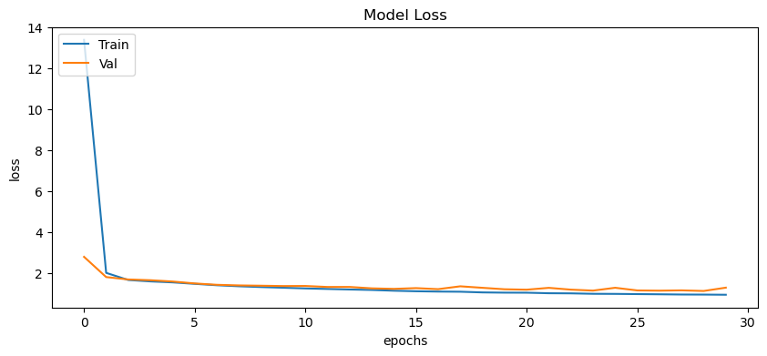

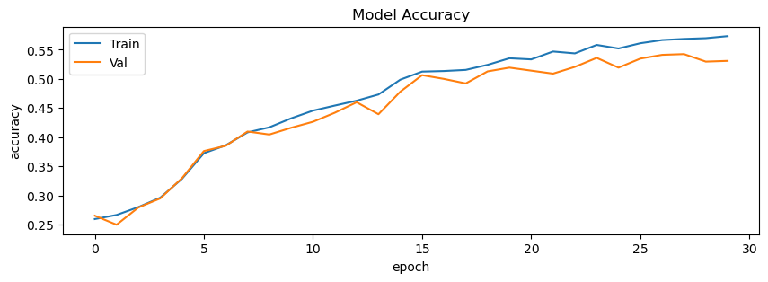

We can see from the learning curves that the model slowly converges and that the model therefore is underfitting. Both the training and validation accuracy curves plateau at a low value, indicating that the model is not learning the patterns in the data well enough 🗿

### Make predictions on the test dataset

```python
show_images_with_predictions(model_underfitting)
```

    1/1 [==============================] - 0s 62ms/step
    1/1 [==============================] - 0s 10ms/step
    1/1 [==============================] - 0s 10ms/step
    1/1 [==============================] - 0s 9ms/step
    1/1 [==============================] - 0s 10ms/step


    2023-03-17 15:56:31.300216: I tensorflow/core/grappler/optimizers/custom_graph_optimizer_registry.cc:113] Plugin optimizer for device_type GPU is enabled.


    1/1 [==============================] - 0s 10ms/step
    1/1 [==============================] - 0s 10ms/step
    1/1 [==============================] - 0s 10ms/step
    1/1 [==============================] - 0s 10ms/step
    1/1 [==============================] - 0s 10ms/step
    1/1 [==============================] - 0s 10ms/step
    1/1 [==============================] - 0s 10ms/step


## Evaluate the performance of the model

```python
print(f'Accuracy: {model_underfitting.evaluate(test_ds)[1]}')
```

    157/157 [==============================] - 1s 7ms/step - loss: 1.2362 - accuracy: 0.5238
    Accuracy: 0.5238094925880432

## Confusion Matrix

The confusion matrix is another way to visualize the performance of the model and whether it is underfitting or not.

```python
true_labels, pred_labels = show_confusion_matrix(model_underfitting)
```

    1/1 [==============================] - 0s 25ms/step
    1/1 [==============================] - 0s 12ms/step
    1/1 [==============================] - 0s 12ms/step
    1/1 [==============================] - 0s 11ms/step
    1/1 [==============================] - 0s 11ms/step
    1/1 [==============================] - 0s 11ms/step
    1/1 [==============================] - 0s 11ms/step
    1/1 [==============================] - 0s 11ms/step
    1/1 [==============================] - 0s 12ms/step
    1/1 [==============================] - 0s 11ms/step
    1/1 [==============================] - 0s 11ms/step
    1/1 [==============================] - 0s 11ms/step
    1/1 [==============================] - 0s 11ms/step
    1/1 [==============================] - 0s 11ms/step
    1/1 [==============================] - 0s 11ms/step
    1/1 [==============================] - 0s 11ms/step
    1/1 [==============================] - 0s 11ms/step
    1/1 [==============================] - 0s 11ms/step
    1/1 [==============================] - 0s 11ms/step
    1/1 [==============================] - 0s 11ms/step
    1/1 [==============================] - 0s 11ms/step
    1/1 [==============================] - 0s 11ms/step
    1/1 [==============================] - 0s 10ms/step
    1/1 [==============================] - 0s 11ms/step
    1/1 [==============================] - 0s 11ms/step
    1/1 [==============================] - 0s 11ms/step
    1/1 [==============================] - 0s 11ms/step
    1/1 [==============================] - 0s 11ms/step
    1/1 [==============================] - 0s 11ms/step
    1/1 [==============================] - 0s 11ms/step
    1/1 [==============================] - 0s 11ms/step
    1/1 [==============================] - 0s 11ms/step
    1/1 [==============================] - 0s 11ms/step
    1/1 [==============================] - 0s 10ms/step
    1/1 [==============================] - 0s 11ms/step
    1/1 [==============================] - 0s 10ms/step
    1/1 [==============================] - 0s 11ms/step
    1/1 [==============================] - 0s 11ms/step
    1/1 [==============================] - 0s 10ms/step
    1/1 [==============================] - 0s 11ms/step
    1/1 [==============================] - 0s 11ms/step
    1/1 [==============================] - 0s 11ms/step
    1/1 [==============================] - 0s 11ms/step
    1/1 [==============================] - 0s 12ms/step
    1/1 [==============================] - 0s 11ms/step
    1/1 [==============================] - 0s 11ms/step
    1/1 [==============================] - 0s 11ms/step
    1/1 [==============================] - 0s 10ms/step
    1/1 [==============================] - 0s 11ms/step
    1/1 [==============================] - 0s 11ms/step
    1/1 [==============================] - 0s 11ms/step
    1/1 [==============================] - 0s 11ms/step
    1/1 [==============================] - 0s 11ms/step
    1/1 [==============================] - 0s 11ms/step
    1/1 [==============================] - 0s 10ms/step
    1/1 [==============================] - 0s 11ms/step
    1/1 [==============================] - 0s 10ms/step
    1/1 [==============================] - 0s 11ms/step
    1/1 [==============================] - 0s 11ms/step
    1/1 [==============================] - 0s 12ms/step
    1/1 [==============================] - 0s 11ms/step
    1/1 [==============================] - 0s 11ms/step
    1/1 [==============================] - 0s 12ms/step
    1/1 [==============================] - 0s 11ms/step
    1/1 [==============================] - 0s 10ms/step
    1/1 [==============================] - 0s 11ms/step
    1/1 [==============================] - 0s 11ms/step
    1/1 [==============================] - 0s 10ms/step
    1/1 [==============================] - 0s 11ms/step
    1/1 [==============================] - 0s 11ms/step
    1/1 [==============================] - 0s 10ms/step
    1/1 [==============================] - 0s 11ms/step
    1/1 [==============================] - 0s 10ms/step
    1/1 [==============================] - 0s 11ms/step
    1/1 [==============================] - 0s 15ms/step
    1/1 [==============================] - 0s 11ms/step
    1/1 [==============================] - 0s 11ms/step
    1/1 [==============================] - 0s 10ms/step
    1/1 [==============================] - 0s 11ms/step
    1/1 [==============================] - 0s 10ms/step
    1/1 [==============================] - 0s 10ms/step
    1/1 [==============================] - 0s 10ms/step
    1/1 [==============================] - 0s 10ms/step
    1/1 [==============================] - 0s 11ms/step
    1/1 [==============================] - 0s 11ms/step
    1/1 [==============================] - 0s 10ms/step
    1/1 [==============================] - 0s 11ms/step
    1/1 [==============================] - 0s 11ms/step
    1/1 [==============================] - 0s 11ms/step
    1/1 [==============================] - 0s 10ms/step
    1/1 [==============================] - 0s 11ms/step
    1/1 [==============================] - 0s 11ms/step
    1/1 [==============================] - 0s 11ms/step
    1/1 [==============================] - 0s 10ms/step
    1/1 [==============================] - 0s 11ms/step
    1/1 [==============================] - 0s 10ms/step
    1/1 [==============================] - 0s 10ms/step
    1/1 [==============================] - 0s 11ms/step
    1/1 [==============================] - 0s 11ms/step
    1/1 [==============================] - 0s 11ms/step
    1/1 [==============================] - 0s 11ms/step
    1/1 [==============================] - 0s 11ms/step
    1/1 [==============================] - 0s 11ms/step
    1/1 [==============================] - 0s 10ms/step
    1/1 [==============================] - 0s 12ms/step
    1/1 [==============================] - 0s 11ms/step
    1/1 [==============================] - 0s 11ms/step
    1/1 [==============================] - 0s 11ms/step
    1/1 [==============================] - 0s 11ms/step
    1/1 [==============================] - 0s 11ms/step
    1/1 [==============================] - 0s 11ms/step
    1/1 [==============================] - 0s 11ms/step
    1/1 [==============================] - 0s 10ms/step
    1/1 [==============================] - 0s 11ms/step
    1/1 [==============================] - 0s 11ms/step
    1/1 [==============================] - 0s 11ms/step
    1/1 [==============================] - 0s 11ms/step
    1/1 [==============================] - 0s 11ms/step
    1/1 [==============================] - 0s 11ms/step
    1/1 [==============================] - 0s 11ms/step
    1/1 [==============================] - 0s 11ms/step
    1/1 [==============================] - 0s 11ms/step
    1/1 [==============================] - 0s 11ms/step
    1/1 [==============================] - 0s 11ms/step
    1/1 [==============================] - 0s 10ms/step
    1/1 [==============================] - 0s 10ms/step
    1/1 [==============================] - 0s 10ms/step
    1/1 [==============================] - 0s 10ms/step
    1/1 [==============================] - 0s 11ms/step
    1/1 [==============================] - 0s 10ms/step
    1/1 [==============================] - 0s 11ms/step
    1/1 [==============================] - 0s 11ms/step
    1/1 [==============================] - 0s 11ms/step
    1/1 [==============================] - 0s 11ms/step
    1/1 [==============================] - 0s 11ms/step
    1/1 [==============================] - 0s 10ms/step
    1/1 [==============================] - 0s 11ms/step
    1/1 [==============================] - 0s 11ms/step
    1/1 [==============================] - 0s 10ms/step
    1/1 [==============================] - 0s 10ms/step
    1/1 [==============================] - 0s 11ms/step
    1/1 [==============================] - 0s 11ms/step
    1/1 [==============================] - 0s 11ms/step
    1/1 [==============================] - 0s 11ms/step
    1/1 [==============================] - 0s 10ms/step
    1/1 [==============================] - 0s 11ms/step
    1/1 [==============================] - 0s 10ms/step
    1/1 [==============================] - 0s 11ms/step
    1/1 [==============================] - 0s 11ms/step
    1/1 [==============================] - 0s 11ms/step
    1/1 [==============================] - 0s 10ms/step
    1/1 [==============================] - 0s 11ms/step
    1/1 [==============================] - 0s 11ms/step
    1/1 [==============================] - 0s 11ms/step
    1/1 [==============================] - 0s 11ms/step
    1/1 [==============================] - 0s 10ms/step
    1/1 [==============================] - 0s 26ms/step

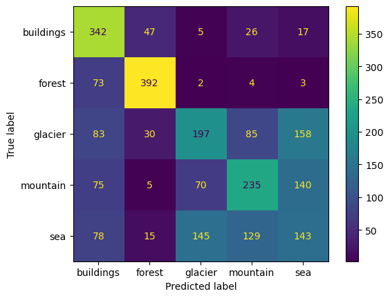

From the confusion matrix we see that predictions for the three classes glacier, mountain and sea are confused with eachother pretty often. This might be because the model did not learn enough characteristics from the classes. Also, these classes contain similar colors - e.g. a mountain or glacier contain a lot of brown while also the sand on an image labeled as sea contains a lot of brown.

In some of the runs, we noticed that the underfitting model tries to stick to one class for the most part (vertical instead of diagonal line in the matrix). We suspect the reason for this being the amount of images assigned to that class in the training set. The classifier knows one class best and tries to match the most images to this class as well. Depending on who ran the notebook, it might be a different class the classifier tries to stick to, as we deleted images of the dataset manually, resulting in different class sizes per person.


## Classification Report

```python
print('Classification Report:\n', metrics.classification_report(y_true=true_labels, y_pred=pred_labels))
```

    Classification Report:
                   precision    recall  f1-score   support

               0       0.53      0.78      0.63       437
               1       0.80      0.83      0.81       474
               2       0.47      0.36      0.41       553
               3       0.49      0.45      0.47       525
               4       0.31      0.28      0.29       510

        accuracy                           0.52      2499
       macro avg       0.52      0.54      0.52      2499
    weighted avg       0.51      0.52      0.51      2499

The classification report shows precision, recall, f1-score and support. Looking at the classification report above, for our underfitting model, we can see it is pretty bad. With a precision (proportion of true positive (TP) predictions among all positive predictions) rate low for all classes, same with the recall score (proportion of TP among all TP and FP), resulting in a low f1-score (mean of precision and recall), it means the model is not good enough for our task.

Support is the number of actual occurrences (images) of a class in the specified dataset. Unbalanced support in the training data may indicate structural weaknesses in the reported results of the classifier and could mean that stratified sampling or rebalancing is needed, which might be the case with our dataset in combination with a weak model like this (see confusion matrix above, last part).

# Overfitting Model

This model will be too complex and will adapt almost perfectly on the training images but will perform poorly on the test data.

The learning curve of the overfitting model will show that the accuracy on the training set is high and improving over time, while the accuracy on the validation set is lower and plateauing or even decreasing over time.

```python
show_images("Example Images", augment=False)
```

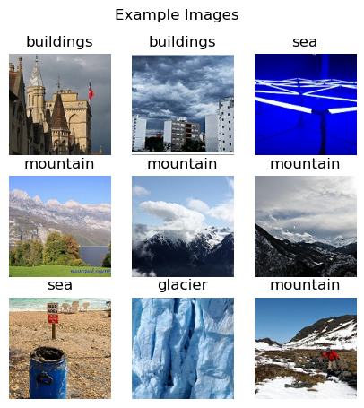

## Building the Model

The SparseCategoricalCrossentropy calculates the loss of a categorical model with labels provided as integer values.

```python
from tensorflow.keras.models import Sequential
from tensorflow.keras.layers import Conv2D, MaxPooling2D, Flatten, Dense

def create_model_overfitting():
    model = Sequential()

    model.add(Conv2D(32, (3,3), input_shape= (img_size,img_size,3), activation = 'relu', padding = 'same')) #padding = same size output
    model.add(MaxPooling2D())

    model.add(Conv2D(64, (3,3), activation = 'relu', padding = 'same'))
    model.add(MaxPooling2D())

    model.add(Conv2D(128, (3,3), activation = 'relu', padding = 'same'))
    model.add(MaxPooling2D())

    model.add(Conv2D(256, (3,3), activation = 'relu', padding = 'same'))
    model.add(MaxPooling2D())

    model.add(Conv2D(512, (3,3), activation = 'relu', padding = 'same'))
    model.add(MaxPooling2D())

    model.add(Flatten())

    model.add(Dense(256, activation='relu'))
    model.add(Dense(5, activation = 'softmax'))

    model.compile(optimizer = 'adam', loss='sparse_categorical_crossentropy', metrics=['accuracy'])

    model._name = "overfitting_model"

    return model
```

```python
overfitting_model = create_model_overfitting()
overfitting_model.summary()
```

    Model: "overfitting_model"
    _________________________________________________________________
     Layer (type)                Output Shape              Param #
    =================================================================
     conv2d_2 (Conv2D)           (None, 150, 150, 32)      896

     max_pooling2d_2 (MaxPooling  (None, 75, 75, 32)       0
     2D)

     conv2d_3 (Conv2D)           (None, 75, 75, 64)        18496

     max_pooling2d_3 (MaxPooling  (None, 37, 37, 64)       0
     2D)

     conv2d_4 (Conv2D)           (None, 37, 37, 128)       73856

     max_pooling2d_4 (MaxPooling  (None, 18, 18, 128)      0
     2D)

     conv2d_5 (Conv2D)           (None, 18, 18, 256)       295168

     max_pooling2d_5 (MaxPooling  (None, 9, 9, 256)        0
     2D)

     conv2d_6 (Conv2D)           (None, 9, 9, 512)         1180160

     max_pooling2d_6 (MaxPooling  (None, 4, 4, 512)        0
     2D)

     flatten_1 (Flatten)         (None, 8192)              0

     dense_1 (Dense)             (None, 256)               2097408

     dense_2 (Dense)             (None, 5)                 1285

    =================================================================
    Total params: 3,667,269
    Trainable params: 3,667,269
    Non-trainable params: 0
    _________________________________________________________________

Having this many trainable parameters means the model will be able to adapt i.e. fit to the training data much better than the underfitting model ever could.

## Training the Model

Learnings: In each epoch all images are sent into the CNN and through backpropagation the weights get adapted. The output of the `model.fit()` process outputs e.g.

```
Epoch 1/20
35/163 [==============================]
```

which indicates that the CNN is currently training the 35th batch of 163 batches of the first epoch. If we use a batch size of 32 we can then calculate the number of images included in the training step: $$163\text{ batches}*32\text{ images/batch }=5216\text{ images}$$
The number of epochs defines how many times the CNN sees the **entire** dataset but in a different order.

Another outcome that we've encountered is that the `model.fit()` process needs at least 30 epochs to converge sufficiently so that the overfitting phenomenon is visible in the loss and accuracy graph.

```python
history = overfitting_model.fit(
    train_ds,
    validation_data=val_ds,
    epochs=50,
)
```

    Epoch 1/50


    2023-03-17 15:56:37.366486: I tensorflow/core/grappler/optimizers/custom_graph_optimizer_registry.cc:113] Plugin optimizer for device_type GPU is enabled.


    195/195 [==============================] - ETA: 0s - loss: 2.7328 - accuracy: 0.4994

    2023-03-17 15:56:43.986198: I tensorflow/core/grappler/optimizers/custom_graph_optimizer_registry.cc:113] Plugin optimizer for device_type GPU is enabled.


    195/195 [==============================] - 8s 37ms/step - loss: 2.7328 - accuracy: 0.4994 - val_loss: 0.9504 - val_accuracy: 0.6250
    Epoch 2/50
    195/195 [==============================] - 7s 35ms/step - loss: 0.9539 - accuracy: 0.6155 - val_loss: 1.0470 - val_accuracy: 0.5451
    Epoch 3/50
    195/195 [==============================] - 7s 35ms/step - loss: 0.8622 - accuracy: 0.6667 - val_loss: 0.8902 - val_accuracy: 0.6314
    Epoch 4/50
    195/195 [==============================] - 7s 34ms/step - loss: 0.7725 - accuracy: 0.6931 - val_loss: 0.7851 - val_accuracy: 0.7139
    Epoch 5/50
    195/195 [==============================] - 7s 34ms/step - loss: 0.6783 - accuracy: 0.7474 - val_loss: 0.7381 - val_accuracy: 0.7178
    Epoch 6/50
    195/195 [==============================] - 7s 34ms/step - loss: 0.6213 - accuracy: 0.7625 - val_loss: 0.7164 - val_accuracy: 0.7152
    Epoch 7/50
    195/195 [==============================] - 7s 34ms/step - loss: 0.5917 - accuracy: 0.8008 - val_loss: 1.8316 - val_accuracy: 0.5335
    Epoch 8/50
    195/195 [==============================] - 7s 34ms/step - loss: 0.7291 - accuracy: 0.7214 - val_loss: 0.9466 - val_accuracy: 0.6869
    Epoch 9/50
    195/195 [==============================] - 7s 36ms/step - loss: 0.5712 - accuracy: 0.7880 - val_loss: 0.7316 - val_accuracy: 0.7487
    Epoch 10/50
    195/195 [==============================] - 7s 35ms/step - loss: 0.4392 - accuracy: 0.8433 - val_loss: 0.7044 - val_accuracy: 0.7629
    Epoch 11/50
    195/195 [==============================] - 7s 34ms/step - loss: 0.3688 - accuracy: 0.8639 - val_loss: 0.8201 - val_accuracy: 0.7706
    Epoch 12/50
    195/195 [==============================] - 7s 35ms/step - loss: 0.3182 - accuracy: 0.8845 - val_loss: 0.9222 - val_accuracy: 0.7732
    Epoch 13/50
    195/195 [==============================] - 7s 35ms/step - loss: 0.3834 - accuracy: 0.8649 - val_loss: 0.7780 - val_accuracy: 0.7861
    Epoch 14/50
    195/195 [==============================] - 7s 34ms/step - loss: 0.2631 - accuracy: 0.9083 - val_loss: 1.1690 - val_accuracy: 0.7204
    Epoch 15/50
    195/195 [==============================] - 7s 34ms/step - loss: 0.2129 - accuracy: 0.9208 - val_loss: 1.2510 - val_accuracy: 0.7423
    Epoch 16/50
    195/195 [==============================] - 7s 35ms/step - loss: 0.1821 - accuracy: 0.9369 - val_loss: 1.1830 - val_accuracy: 0.7706
    Epoch 17/50
    195/195 [==============================] - 7s 34ms/step - loss: 0.1768 - accuracy: 0.9334 - val_loss: 1.2568 - val_accuracy: 0.7526
    Epoch 18/50
    195/195 [==============================] - 7s 35ms/step - loss: 0.2545 - accuracy: 0.9186 - val_loss: 1.0130 - val_accuracy: 0.7410
    Epoch 19/50
    195/195 [==============================] - 7s 34ms/step - loss: 0.1537 - accuracy: 0.9540 - val_loss: 1.3307 - val_accuracy: 0.7758
    Epoch 20/50
    195/195 [==============================] - 7s 35ms/step - loss: 0.2013 - accuracy: 0.9344 - val_loss: 1.1946 - val_accuracy: 0.7268
    Epoch 21/50
    195/195 [==============================] - 7s 35ms/step - loss: 0.1383 - accuracy: 0.9582 - val_loss: 1.2634 - val_accuracy: 0.7281
    Epoch 22/50
    195/195 [==============================] - 7s 35ms/step - loss: 0.2105 - accuracy: 0.9282 - val_loss: 1.2727 - val_accuracy: 0.7049
    Epoch 23/50
    195/195 [==============================] - 7s 35ms/step - loss: 0.1262 - accuracy: 0.9556 - val_loss: 1.7683 - val_accuracy: 0.7358
    Epoch 24/50
    195/195 [==============================] - 7s 35ms/step - loss: 0.1589 - accuracy: 0.9543 - val_loss: 1.4754 - val_accuracy: 0.7423
    Epoch 25/50
    195/195 [==============================] - 7s 35ms/step - loss: 0.1659 - accuracy: 0.9501 - val_loss: 1.6341 - val_accuracy: 0.7152
    Epoch 26/50
    195/195 [==============================] - 7s 35ms/step - loss: 0.1079 - accuracy: 0.9669 - val_loss: 1.5724 - val_accuracy: 0.7552
    Epoch 27/50
    195/195 [==============================] - 7s 35ms/step - loss: 0.1062 - accuracy: 0.9688 - val_loss: 1.4662 - val_accuracy: 0.7526
    Epoch 28/50
    195/195 [==============================] - 7s 34ms/step - loss: 0.0567 - accuracy: 0.9804 - val_loss: 2.6992 - val_accuracy: 0.6546
    Epoch 29/50
    195/195 [==============================] - 7s 35ms/step - loss: 0.1860 - accuracy: 0.9434 - val_loss: 1.2589 - val_accuracy: 0.7758
    Epoch 30/50
    195/195 [==============================] - 7s 35ms/step - loss: 0.0588 - accuracy: 0.9813 - val_loss: 1.4752 - val_accuracy: 0.7938
    Epoch 31/50
    195/195 [==============================] - 7s 36ms/step - loss: 0.0547 - accuracy: 0.9801 - val_loss: 1.9605 - val_accuracy: 0.7500
    Epoch 32/50
    195/195 [==============================] - 7s 38ms/step - loss: 0.0891 - accuracy: 0.9772 - val_loss: 1.7923 - val_accuracy: 0.7320
    Epoch 33/50
    195/195 [==============================] - 7s 35ms/step - loss: 0.1650 - accuracy: 0.9476 - val_loss: 1.6971 - val_accuracy: 0.7178
    Epoch 34/50
    195/195 [==============================] - 7s 35ms/step - loss: 0.2472 - accuracy: 0.9308 - val_loss: 1.5022 - val_accuracy: 0.7178
    Epoch 35/50
    195/195 [==============================] - 7s 35ms/step - loss: 0.1747 - accuracy: 0.9456 - val_loss: 1.5738 - val_accuracy: 0.7255
    Epoch 36/50
    195/195 [==============================] - 7s 35ms/step - loss: 0.0262 - accuracy: 0.9891 - val_loss: 1.6579 - val_accuracy: 0.7448
    Epoch 37/50
    195/195 [==============================] - 7s 35ms/step - loss: 0.1385 - accuracy: 0.9601 - val_loss: 1.4717 - val_accuracy: 0.7461
    Epoch 38/50
    195/195 [==============================] - 7s 35ms/step - loss: 0.1113 - accuracy: 0.9675 - val_loss: 1.7040 - val_accuracy: 0.7436
    Epoch 39/50
    195/195 [==============================] - 7s 35ms/step - loss: 0.0567 - accuracy: 0.9833 - val_loss: 1.7042 - val_accuracy: 0.7680
    Epoch 40/50
    195/195 [==============================] - 7s 36ms/step - loss: 0.0507 - accuracy: 0.9823 - val_loss: 1.8683 - val_accuracy: 0.7616
    Epoch 41/50
    195/195 [==============================] - 7s 35ms/step - loss: 0.0263 - accuracy: 0.9920 - val_loss: 1.8265 - val_accuracy: 0.7680
    Epoch 42/50
    195/195 [==============================] - 7s 35ms/step - loss: 0.0973 - accuracy: 0.9797 - val_loss: 2.2407 - val_accuracy: 0.6933
    Epoch 43/50
    195/195 [==============================] - 7s 34ms/step - loss: 0.1624 - accuracy: 0.9620 - val_loss: 1.8549 - val_accuracy: 0.7345
    Epoch 44/50
    195/195 [==============================] - 7s 35ms/step - loss: 0.1223 - accuracy: 0.9665 - val_loss: 1.7463 - val_accuracy: 0.7564
    Epoch 45/50
    195/195 [==============================] - 7s 35ms/step - loss: 0.0972 - accuracy: 0.9720 - val_loss: 1.8694 - val_accuracy: 0.7590
    Epoch 46/50
    195/195 [==============================] - 7s 34ms/step - loss: 0.0740 - accuracy: 0.9829 - val_loss: 1.7748 - val_accuracy: 0.7655
    Epoch 47/50
    195/195 [==============================] - 7s 34ms/step - loss: 0.0807 - accuracy: 0.9826 - val_loss: 1.6050 - val_accuracy: 0.7461
    Epoch 48/50
    195/195 [==============================] - 7s 34ms/step - loss: 0.0812 - accuracy: 0.9807 - val_loss: 1.9932 - val_accuracy: 0.7126
    Epoch 49/50
    195/195 [==============================] - 7s 34ms/step - loss: 0.1335 - accuracy: 0.9675 - val_loss: 2.2391 - val_accuracy: 0.7242
    Epoch 50/50
    195/195 [==============================] - 7s 36ms/step - loss: 0.1498 - accuracy: 0.9591 - val_loss: 1.4425 - val_accuracy: 0.7539

```python
visualize_results(history)
```

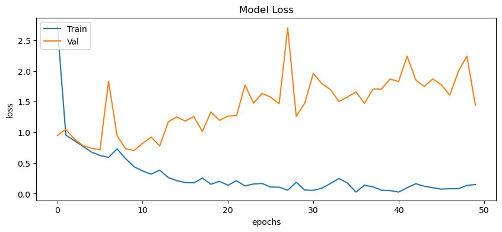

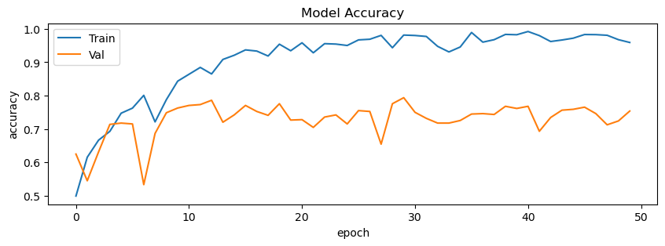

The accuracy graph makes visible that the train accuracy will come really close or actually is 1 during the training phase. That means the classifier has adapted itself very well to the training dataset. Which also means it has adapted itself very well to the noise.

The validation dataset contains pictures that the classifier has not seen before, and as the model fits too much to the training data, it cannot predict the classes of the validation data well enough. The loss graph shows the same phenomenon. In that case, the validation loss increases, while the training loss decreases.

```python
overfitting_model.evaluate(test_ds)
```

    157/157 [==============================] - 2s 15ms/step - loss: 1.3736 - accuracy: 0.7595


    [1.3735682964324951, 0.7595037817955017]

Again the model does not perform as well on new data (this time the testing dataset) as it performed on the training data.

```python
show_images_with_predictions(overfitting_model)
```

    1/1 [==============================] - 0s 145ms/step
    1/1 [==============================] - 0s 35ms/step


    2023-03-17 16:02:21.166876: I tensorflow/core/grappler/optimizers/custom_graph_optimizer_registry.cc:113] Plugin optimizer for device_type GPU is enabled.


    1/1 [==============================] - 0s 12ms/step
    1/1 [==============================] - 0s 12ms/step
    1/1 [==============================] - 0s 12ms/step
    1/1 [==============================] - 0s 13ms/step
    1/1 [==============================] - 0s 13ms/step
    1/1 [==============================] - 0s 11ms/step
    1/1 [==============================] - 0s 12ms/step
    1/1 [==============================] - 0s 13ms/step
    1/1 [==============================] - 0s 12ms/step
    1/1 [==============================] - 0s 12ms/step

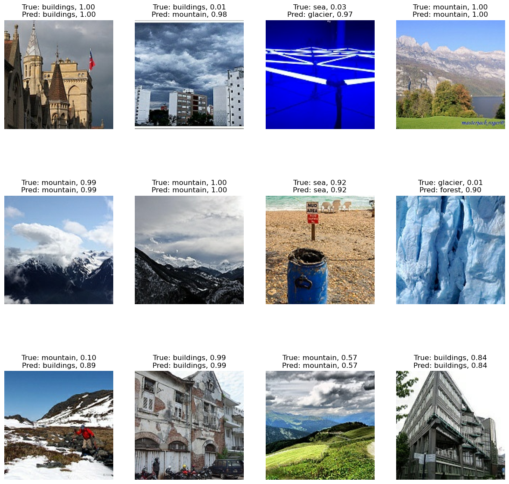

Unlike the underfitting model, the overfitting model is occasionally 100% sure an image will belong to a certain class. Which is sometimes true, sometimes not (visualized above for the test dataset).

## Confusion Matrix

```python
true_labels, pred_labels = show_confusion_matrix(overfitting_model)
```

    1/1 [==============================] - 0s 49ms/step
    1/1 [==============================] - 0s 18ms/step
    1/1 [==============================] - 0s 12ms/step
    1/1 [==============================] - 0s 12ms/step
    1/1 [==============================] - 0s 17ms/step
    1/1 [==============================] - 0s 12ms/step
    1/1 [==============================] - 0s 12ms/step
    1/1 [==============================] - 0s 12ms/step
    1/1 [==============================] - 0s 13ms/step
    1/1 [==============================] - 0s 12ms/step
    1/1 [==============================] - 0s 13ms/step
    1/1 [==============================] - 0s 12ms/step
    1/1 [==============================] - 0s 12ms/step
    1/1 [==============================] - 0s 12ms/step
    1/1 [==============================] - 0s 12ms/step
    1/1 [==============================] - 0s 12ms/step
    1/1 [==============================] - 0s 14ms/step
    1/1 [==============================] - 0s 13ms/step
    1/1 [==============================] - 0s 12ms/step
    1/1 [==============================] - 0s 12ms/step
    1/1 [==============================] - 0s 12ms/step
    1/1 [==============================] - 0s 13ms/step
    1/1 [==============================] - 0s 12ms/step
    1/1 [==============================] - 0s 12ms/step
    1/1 [==============================] - 0s 12ms/step
    1/1 [==============================] - 0s 13ms/step
    1/1 [==============================] - 0s 13ms/step
    1/1 [==============================] - 0s 13ms/step
    1/1 [==============================] - 0s 12ms/step
    1/1 [==============================] - 0s 12ms/step
    1/1 [==============================] - 0s 13ms/step
    1/1 [==============================] - 0s 12ms/step
    1/1 [==============================] - 0s 12ms/step
    1/1 [==============================] - 0s 12ms/step
    1/1 [==============================] - 0s 12ms/step
    1/1 [==============================] - 0s 12ms/step
    1/1 [==============================] - 0s 12ms/step
    1/1 [==============================] - 0s 12ms/step
    1/1 [==============================] - 0s 12ms/step
    1/1 [==============================] - 0s 12ms/step
    1/1 [==============================] - 0s 12ms/step
    1/1 [==============================] - 0s 12ms/step
    1/1 [==============================] - 0s 13ms/step
    1/1 [==============================] - 0s 12ms/step
    1/1 [==============================] - 0s 12ms/step
    1/1 [==============================] - 0s 12ms/step
    1/1 [==============================] - 0s 13ms/step
    1/1 [==============================] - 0s 12ms/step
    1/1 [==============================] - 0s 12ms/step
    1/1 [==============================] - 0s 12ms/step
    1/1 [==============================] - 0s 13ms/step
    1/1 [==============================] - 0s 13ms/step
    1/1 [==============================] - 0s 13ms/step
    1/1 [==============================] - 0s 13ms/step
    1/1 [==============================] - 0s 12ms/step
    1/1 [==============================] - 0s 13ms/step
    1/1 [==============================] - 0s 12ms/step
    1/1 [==============================] - 0s 12ms/step
    1/1 [==============================] - 0s 12ms/step
    1/1 [==============================] - 0s 13ms/step
    1/1 [==============================] - 0s 13ms/step
    1/1 [==============================] - 0s 13ms/step
    1/1 [==============================] - 0s 12ms/step
    1/1 [==============================] - 0s 12ms/step
    1/1 [==============================] - 0s 13ms/step
    1/1 [==============================] - 0s 13ms/step
    1/1 [==============================] - 0s 13ms/step
    1/1 [==============================] - 0s 12ms/step
    1/1 [==============================] - 0s 13ms/step
    1/1 [==============================] - 0s 12ms/step
    1/1 [==============================] - 0s 13ms/step
    1/1 [==============================] - 0s 13ms/step
    1/1 [==============================] - 0s 12ms/step
    1/1 [==============================] - 0s 12ms/step
    1/1 [==============================] - 0s 11ms/step
    1/1 [==============================] - 0s 12ms/step
    1/1 [==============================] - 0s 12ms/step
    1/1 [==============================] - 0s 12ms/step
    1/1 [==============================] - 0s 12ms/step
    1/1 [==============================] - 0s 12ms/step
    1/1 [==============================] - 0s 12ms/step
    1/1 [==============================] - 0s 12ms/step
    1/1 [==============================] - 0s 13ms/step
    1/1 [==============================] - 0s 12ms/step
    1/1 [==============================] - 0s 11ms/step
    1/1 [==============================] - 0s 13ms/step
    1/1 [==============================] - 0s 12ms/step
    1/1 [==============================] - 0s 13ms/step
    1/1 [==============================] - 0s 14ms/step
    1/1 [==============================] - 0s 13ms/step
    1/1 [==============================] - 0s 14ms/step
    1/1 [==============================] - 0s 13ms/step
    1/1 [==============================] - 0s 12ms/step
    1/1 [==============================] - 0s 12ms/step
    1/1 [==============================] - 0s 12ms/step
    1/1 [==============================] - 0s 12ms/step
    1/1 [==============================] - 0s 12ms/step
    1/1 [==============================] - 0s 12ms/step
    1/1 [==============================] - 0s 12ms/step
    1/1 [==============================] - 0s 12ms/step
    1/1 [==============================] - 0s 12ms/step
    1/1 [==============================] - 0s 12ms/step
    1/1 [==============================] - 0s 12ms/step
    1/1 [==============================] - 0s 12ms/step
    1/1 [==============================] - 0s 12ms/step
    1/1 [==============================] - 0s 12ms/step
    1/1 [==============================] - 0s 12ms/step
    1/1 [==============================] - 0s 12ms/step
    1/1 [==============================] - 0s 12ms/step
    1/1 [==============================] - 0s 13ms/step
    1/1 [==============================] - 0s 13ms/step
    1/1 [==============================] - 0s 13ms/step
    1/1 [==============================] - 0s 13ms/step
    1/1 [==============================] - 0s 14ms/step
    1/1 [==============================] - 0s 12ms/step
    1/1 [==============================] - 0s 13ms/step
    1/1 [==============================] - 0s 12ms/step
    1/1 [==============================] - 0s 12ms/step
    1/1 [==============================] - 0s 21ms/step
    1/1 [==============================] - 0s 12ms/step
    1/1 [==============================] - 0s 13ms/step
    1/1 [==============================] - 0s 13ms/step
    1/1 [==============================] - 0s 13ms/step
    1/1 [==============================] - 0s 11ms/step
    1/1 [==============================] - 0s 13ms/step
    1/1 [==============================] - 0s 14ms/step
    1/1 [==============================] - 0s 14ms/step
    1/1 [==============================] - 0s 13ms/step
    1/1 [==============================] - 0s 13ms/step
    1/1 [==============================] - 0s 13ms/step
    1/1 [==============================] - 0s 13ms/step
    1/1 [==============================] - 0s 14ms/step
    1/1 [==============================] - 0s 12ms/step
    1/1 [==============================] - 0s 13ms/step
    1/1 [==============================] - 0s 13ms/step
    1/1 [==============================] - 0s 13ms/step
    1/1 [==============================] - 0s 13ms/step
    1/1 [==============================] - 0s 13ms/step
    1/1 [==============================] - 0s 13ms/step
    1/1 [==============================] - 0s 13ms/step
    1/1 [==============================] - 0s 14ms/step
    1/1 [==============================] - 0s 12ms/step
    1/1 [==============================] - 0s 13ms/step
    1/1 [==============================] - 0s 13ms/step
    1/1 [==============================] - 0s 12ms/step
    1/1 [==============================] - 0s 12ms/step
    1/1 [==============================] - 0s 13ms/step
    1/1 [==============================] - 0s 12ms/step
    1/1 [==============================] - 0s 12ms/step
    1/1 [==============================] - 0s 13ms/step
    1/1 [==============================] - 0s 13ms/step
    1/1 [==============================] - 0s 13ms/step
    1/1 [==============================] - 0s 12ms/step
    1/1 [==============================] - 0s 12ms/step
    1/1 [==============================] - 0s 11ms/step
    1/1 [==============================] - 0s 13ms/step
    1/1 [==============================] - 0s 52ms/step

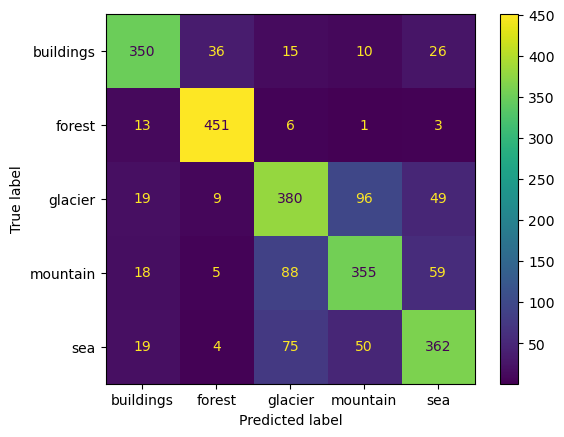

The confusion matrix of the overfitting model looks not too bad. Some predictions are pretty accurate, others are less but in general the model is not performing too bad. Same as for the underfitting model, we see some confusions between the three classes glacier, mountain and sea.

## Classification Report

```python
print('Classification Report:\n', metrics.classification_report(y_true=true_labels, y_pred=pred_labels))
```

    Classification Report:
                   precision    recall  f1-score   support

               0       0.79      0.83      0.81       437
               1       0.92      0.93      0.93       474
               2       0.72      0.68      0.70       553
               3       0.67      0.70      0.69       525
               4       0.65      0.63      0.64       510

        accuracy                           0.75      2499
       macro avg       0.75      0.75      0.75      2499
    weighted avg       0.75      0.75      0.75      2499

Comparing the classification report to the underfitting model, we see an increase of the values in every metric. This is because more trainable parameters result in a model that is able to learn more details of the images.

# Optimized Model

This model does not show under- or overfitting and performs well on both, training and testing data. Afterwards, a brief description on how to tackle the challenges of an optimal model complexity.

To address underfitting, one approach is to increase the complexity of the model by increasing the number of trainable parameters or for our project, increase the image size (which results in larger feature maps).

To address overfitting, we can try several approaches. One approach is to simplify the model by decreasing the number of trainable parameters or to introduce generalization and regularization methods. Another approach is to use less epochs for example (which not always the best approach to be fair).

Adding dropout or weight decay can help to address both of the above mentioned issues. We can also try adjusting the hyperparameters such as learning rate, batch size, or number of epochs.

## GPU Acceleration

We found out that training a model on images can be a very time consuming task, especially if many images are involved. Randomly we stumbled upon an article that stated about "GPU Acceleration" which sounded pretty interesting. Afterwards, we read a bit about the topic and found out that it is possible on our Apple M1 Pro / M2 Pro chips. After a lot of trial and error we ended up using the tensorflow-macos and tensorflow-metal packages but with specific versions because the newest versions did not work. With the both packages installed correctly, both the CPU and GPU are being used for training. The CPU on the M2 Pro chip has 12 cores and its GPU has 19 cores. The total of 31 cores over 12 cores already indicates that usage of the GPU would lead to massive performance improvements. The following image shows the CPU and GPU usage during training of the optimized model:

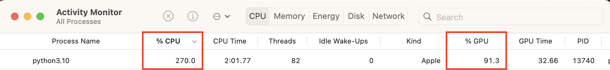

When we were utilizing the CPU only, training took ~100s per epoch for the overfitting model (there were ~11'000'000 trainable parameters, our overfitting model has changed since). After enabling GPU acceleration we came down to astonishing ~10s per epoch. This factor of 10 improvement was even more than we hoped for and enabled us to test more parameters, because training took about 2 minutes instead of the usual 20 minutes.

## Data Augmentation

Data Augmentation has proven to be a useful tool for model generalization. We've compared the same model with and without data augmentation and the results show that the model without data augmentation tends to overfit while the model with data augmentation doesn't:

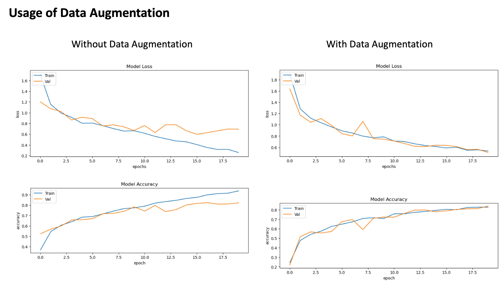

The reason for this is that data augmentation reduces the generalization error. It introduces new samples to the dataset, by rotating, zooming, and otherwise altering existing images. This increases the size of the dataset, forces the model to learn features of the dataset in a different way, and thus reduces the model's tendency to overfit (more on that later).

During this project we've also encountered some downsides of data augmentation. One apparent downside is that it drastically slows down the training because the images are being preprocessed and the amount of data increases. Because of this reason, we've turned off data augmentation for the KFold Cross Validation.

```python
show_images("Augmented Images (flipped, rotated, zoomed)", augment=True)
```

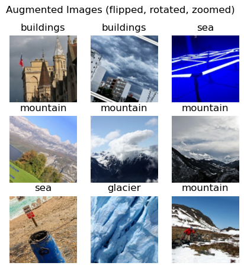

The above images can be compared to the output images from the previous models to see the effect of data augmentation.

## Building the Model

As a baseline we used the same model as the overfitting one but we add some extras to reduce the overfitting behavior.

### Regularization

Regularization is used to reduce the impact impact of the weights. The weights then end up having less impact on the loss function which determines the error between the actual label and predicted label. This reduces complexity of the model and therefore reduces overfitting. We are adding the same regularization parameter to all of the Conv2D layers. We are using L2 (Ridge) regularization since it predetermined from the task.

#### Dropout Layers

The benefit of using dropout is, as mentioned earlier, that no node in the network will be assigned with high parameter values, as a a result the parameter values will be dependent on multiple nodes of the previous' layer, but instead each node of the previous layer forwards robust and standalone information.
E.g. `dropout(0.2)` turns off the nodes of a layer (sets their weights to 0) at a probability of 0.2. Dropout is applied per batch size, so the parameters get tuned for a full batch size with missing input parameters which results in a lower generalization error. Therefore, optimizing dropout parameters along with batch size would make sense for parameter optimizing using KFold Cross Validation. The results of this experiment can be found below under the topic "Batch Size".

### Generalization

To improve generalization of the model, data augmentation is a useful tool. With data augmentation we can add artificial effects to the images such as flipping and rotating. Through these effects, the images always appear differently each time they are being used in a training step. Therefore the CNN doesn't adapt to the exact images, but rather learns about the relative features inside of an image.

### Optimizer

For the optimized model we chose Adam over the competitors because it is the most common among Stochastic Gradient Descent (SGD). We tried out SGD itself, but it performed poorly compared to Adam. Adam optimization is a SGD method that is based on adaptive estimation of first-order (mean) and second-order (uncentered variance) moments. Its default implementation already provides a form of annealed learning, beta_1=0.9 for the first-order moment and beta_2=0.999 for the second-order moment.

### Activation Function

The [following article](https://thangasami.medium.com/cnn-and-ann-performance-with-different-activation-functions-like-relu-selu-elu-sigmoid-gelu-etc-c542dd3b1365) states that ReLU is the overall the best suited activation function so based on this we decided to use ReLU for our optimized model. In general, non-saturated activation functions tend to be more efficient than saturated activation functions.

### Batch Size

The batch size defines how many samples (in our case images) run through the neural network before the weights get adapted. It is recommended to use mini batches to update the neural network multiple times during an epoch. We've tried out differnt batch sizes with the same seed on the image generator. To find the optimal batch size we've used the KFold Cross Validation method to see which combination of dropout and batch size works the best. For the dropout parameter we tried out the values 0.1, 0.2 and 0.3 whereas for the batch size we tried out 16, 32 and 128.

Upon running 5-fold Cross Validation with the given parameters, we obtained the following values:

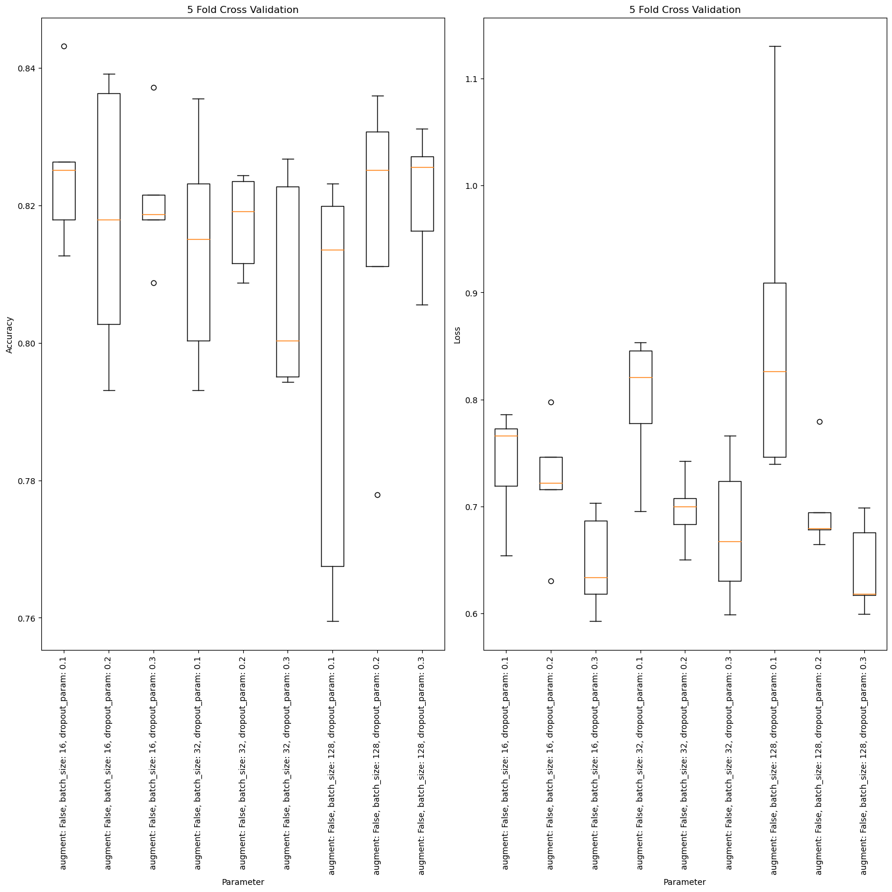

On a first sight it wasn't clear which parameter is the best. But one thing that was clear is that the loss for dropout=0.3 is always the smallest so we used this parameter to test again for the different batch sizes and got the following diagram:

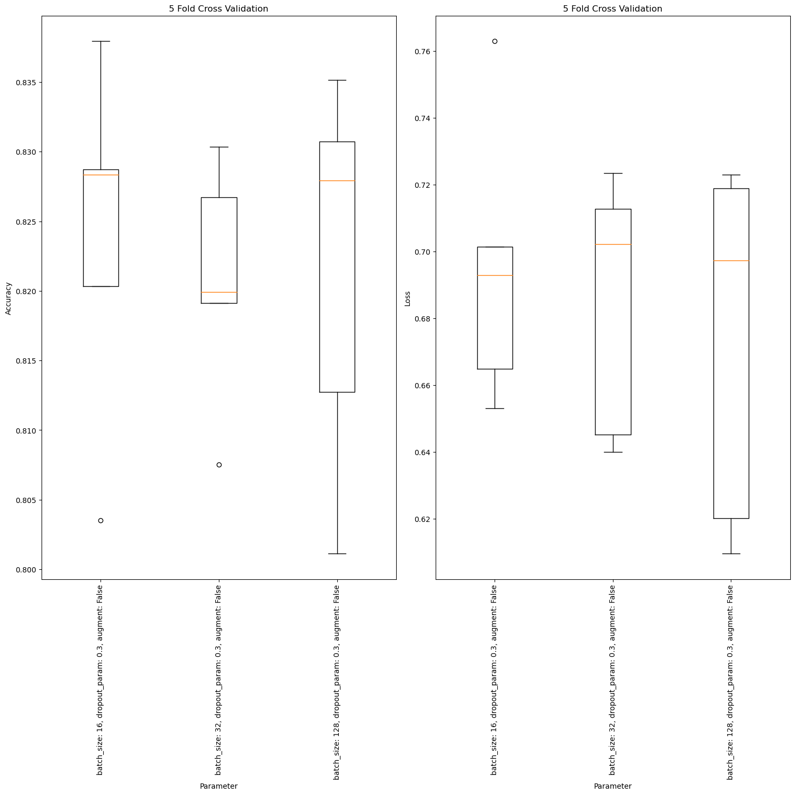

We also analyzed the training convergence of the three batch sizes:

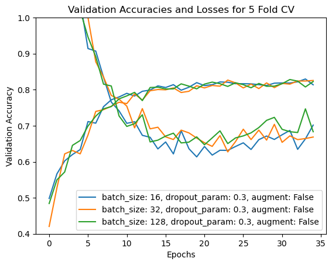

For simplification, the above lines for accuracy and loss use the same color and can be differentiated over the course of multiple epochs such as the loss comes from the top and gets lower while the accuracy comes from the bottom and rises higher.

With all those considerations we did not find an ideal parameter and would need to make more tests in order to find an ideal parameter. But for the sake of this project we took a batch size of 16 paired with a dropout of 30%.

## The Model

```python
from tensorflow.keras.layers import Conv2D, MaxPooling2D, Flatten, Dense, Dropout, BatchNormalization
from tensorflow.keras.losses import SparseCategoricalCrossentropy
from tensorflow.keras.regularizers import l2

def create_model_optimized(l2_param=0.001, dropout_param=0.3, last_layer_param=512, augment=True, weight_factor=1, batch_size=16):
    model = Sequential()

    import_datasets(batch_size)

    if augment:
        model.add(data_augmentation)
    model.add(BatchNormalization(input_shape= (img_size,img_size, 3)))

    model.add(Conv2D(32 * weight_factor, (3,3), activation = 'relu', padding = 'same'))
    model.add(MaxPooling2D())
    model.add(Dropout(dropout_param))

    model.add(Conv2D(64 * weight_factor, (3,3), activation = 'relu', padding = 'same', kernel_regularizer=l2(l=l2_param)))
    model.add(MaxPooling2D())
    model.add(Dropout(dropout_param))

    model.add(Conv2D(128 * weight_factor, (3,3), activation = 'relu', padding = 'same', kernel_regularizer=l2(l=l2_param)))
    model.add(MaxPooling2D())
    model.add(Dropout(dropout_param))

    model.add(Conv2D(256 * weight_factor, (3,3), activation = 'relu', padding = 'same', kernel_regularizer=l2(l=l2_param)))
    model.add(MaxPooling2D())
    model.add(Dropout(dropout_param))

    model.add(Conv2D(last_layer_param * weight_factor, (3,3), activation = 'relu', padding = 'same', kernel_regularizer=l2(l=l2_param)))
    model.add(MaxPooling2D())
    model.add(Dropout(0.4))

    model.add(Flatten())

    model.add(Dense(256, activation='relu'))
    model.add(Dense(5, activation = 'softmax'))

    model.compile(
       optimizer = 'adam',
       loss=SparseCategoricalCrossentropy(from_logits=False),
       metrics=['accuracy']
    )

    return model
```

### First Layer

The RGB channel values are in the [0, 255] range. This is not ideal for a neural network because in general, the input values should be small. Therefore, we use the `BatchNormalization` layer as a normalization layer.

### Dropout

With Cross Validation we've tried out different dropout params (0.2, 0.3, 0.4) for the layer before the dense layers. The results are pretty similar but the 0.3 dropout seems to be more stable at the end of 30 epochs so we used this parameter for the model.

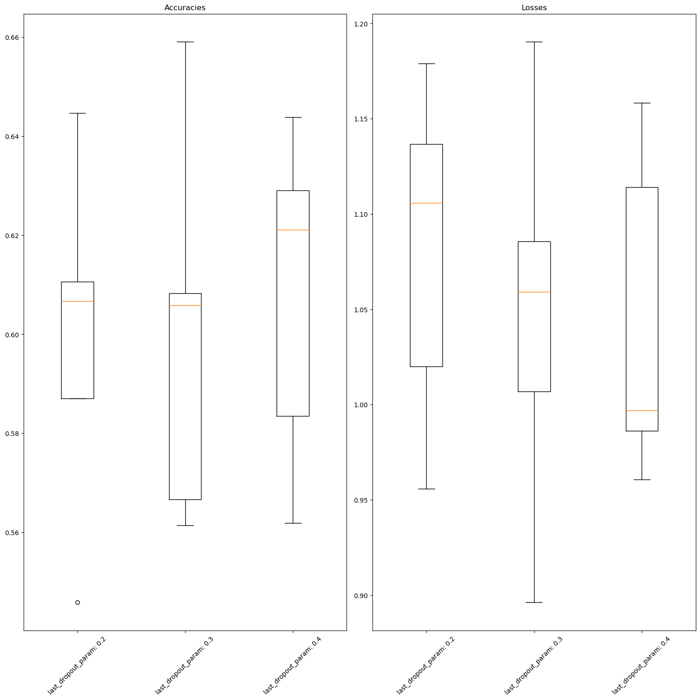

### Loss Function

Because we use the SoftMax activation function as the output of the last Dense Layer, we get normalized probabilites, [0, 1]. The SparseCategoricalCrossentry function's from_logits=True would expect Logits which are in the range of [-inf, +inf] and therefore, we use `from_logits=False`.

As the optimizer, we also tried out SGD with annealed learning but in the course of 20 epochs we reached poorer results than with adam.

To speed up the training with KFold Cross Validation, we've introduced a parameter to turn off data augmentation and another parameter to use more parameters since they seriously slow down training, which affects Cross Validation too much.

## Cross Validation for Parameter Optimization

For k-fold Cross Validation parameter optimization we are using a sklearn's KFold method paired with a custom functionality to fit the model with different parameter values. We tried to use GridSearchCV (as we did in the AI Foundation course) but we first thought that the model parameters (such as the regularization parameter of the 2nd Conv2D layer) are not accessible from the `param_grid` that is passed to GridSearchCV (which we later found out is not the case). We then came up with a custom KFold Cross Validation approach which is fully flexible and uses if-else statements in the model creation step. With this Cross Validation implementation we've tuned parameters such as the l2 regularization paramter, the batch size or the dropout percentage.

The following image visualizes the results of the l2 regularization parameter. We tested for the values 0.01, 0.001 and 0.0001 and ran a 5-fold Cross Validation with 10 epochs for each value. The regularizer is being used in three Conv2D layers of the model. As from the diagram below it is apparent that the accuracy improved the smaller the l2 regularization parameter was, and therefore, we decided to use l2=0.0001.

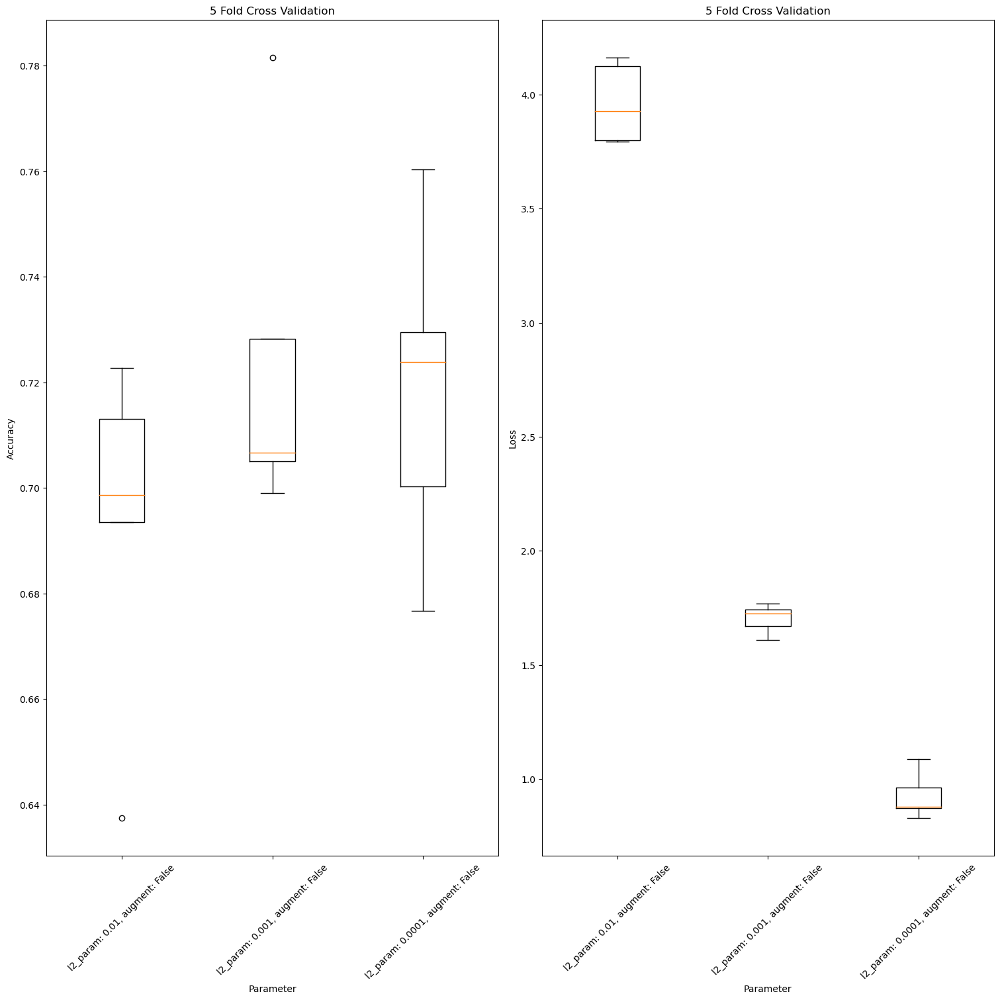

### Development of the KFold CV Functionality

The part of splitting the full dataset into testing and validation data by the indices obtained by the KFold split was pretty tricky. We've encountered that it is not always convenient and easy to handle the tensorflow data. Especially without experience of the huge framework it was difficult to find information about splitting a dataset and we ended up trying out numerous ways. We've also consulted ChatGPT which also did not lead us to a correctly working result. After trying out many ways, we've stumbled upon `dataset.unbatch()` which then enabled us to convert the tensorflow dataset to a numpy array where we were able to rely on the indices generated by `sklearn.KFold()`.

During the usage of the intense training functionality of KFold Cross Validation we encountered a problem using tensorflow-metal with GPU acceleration. The problem is that the python process hangs up after approximately the 8-th fold of a 10 epoch training process. This was very inconvenient because we were not able to perform the parameter optimization in one step and needed to temporarily store the results for each parameter which we made by saving the results in a JSON file. Luckily, we were able to perform the 5-fold Cross Validation of at least one parameter before the process hung up. The issue of this behavior is known but does not seem to be fixed yet, as can be seen [here](https://developer.apple.com/forums/thread/713944).

As already mentioned, we've turned off data augmentation for Cross Validation in favor of performance.

```python
import itertools
from sklearn.model_selection import KFold
import tensorflow as tf
import json

param_grid=dict(
    # last_layer_param=[512, 1024, 2048]
    l2_param=[0.01, 0.001, 0.0001],
    augment=[False],
    # dropout_param=[0.2, 0.3, 0.4]
    # batch_size=[16, 32, 128],
)
epochs = 30
folds = 5

keys = list(param_grid.keys())
params = list(param_grid.get(x) for x in keys)
param_permutations = list(itertools.product(*params))

model_history = dict()

kfold = KFold(n_splits=folds, shuffle=True)

for perm in param_permutations:
    model_args = dict()
    for index in range(len(params)):
        key = keys[index]
        value = perm[index]
        model_args[key] = value

    # Set title according to the params for later visualization
    title = ", ".join(list((key + ": " + str(model_args[key])) for key in model_args.keys()))

    print("CURRENTLY TRAINING THE MODEL WITH THE FOLLOWING PARAMS: " + title)
    model_history[title] = []

    for fold, (train_indices, val_indices) in enumerate(kfold.split(train_images)):
        print(f'Fold {fold+1}/{folds}, (params={title})')

        X_train, y_train = train_images[train_indices], train_labels[train_indices]
        X_val, y_val = train_images[val_indices], train_labels[val_indices]

        model = create_model_optimized(**model_args)

        history = model.fit(
            X_train,
            y_train,
            validation_data=(X_val, y_val),
            epochs=epochs
        )

        # Evaluate the model on the validation dataset for this fold
        loss, acc = model.evaluate(test_ds)
        print(f'Test accuracy: {acc:.3f}\n')

        # Use title as key for easy usage
        model_history[title].append(dict(fold=fold, loss=loss, acc=acc, history=history))

    with open(f'model-history-{title}.json', 'w') as f:
        json.dump(model_history, f, default=lambda o: '<not serializable>')
```

<i>We've intentionally cleared the output of the Cross Validation because it generated 60 pages of ouptput in the pdf.</i>

### Visualizaton of the Parameter Performance

```python
# The following data has been generated with the above custom KFold Cross Validation method
accuracies = dict()
losses = dict()
for key in model_history.keys():
    accuracies[key] = []
    losses[key] = []
    for entry in model_history[key]:
        losses[key].append(entry["loss"])
        accuracies[key].append(entry["acc"])

fig, ax = plt.subplots(1, 2, constrained_layout=True)
ax[0].set_title("5 Fold Cross Validation")
ax[0].set_ylabel("Accuracy")
ax[0].set_xlabel("Parameter")
ax[0].boxplot(accuracies.values())
ax[0].set_xticklabels(accuracies.keys(), rotation=45)
ax[1].set_title("5 Fold Cross Validation")
ax[1].set_ylabel("Loss")
ax[1].set_xlabel("Parameter")
ax[1].boxplot(losses.values())
ax[1].set_xticklabels(losses.keys(), rotation=45)

fig.set_figheight(15)
fig.set_figwidth(15)
```

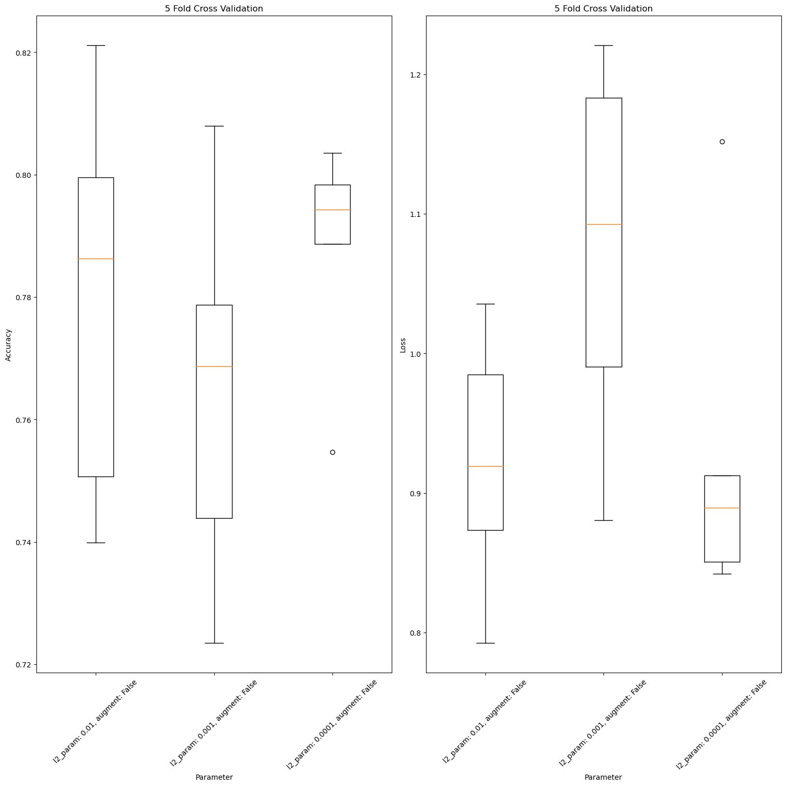

From the above diagram we concluded that the loss for l2=0.0001 is the smallest and also the accuarcy is the highest and, therefore, decided to use this parameter value for the optimized model.

#### Visualization of the Test Accuracy for each Fold

```python
for m_key in model_history:
    for item in model_history.get(m_key):
        for key in item:
            if key == 'history':
                history = item.get('history')
                fold = item.get("fold")
                plt.plot(history.history['val_accuracy'], label=f"Fold {fold}")
    plt.title(f"Accuracies for {folds} Fold CV, with {m_key}")
    plt.ylabel("Test Accuracy")
    plt.xlabel("Epochs")
    plt.legend(loc= 'upper left')
    plt.show()
```

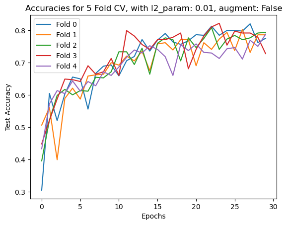

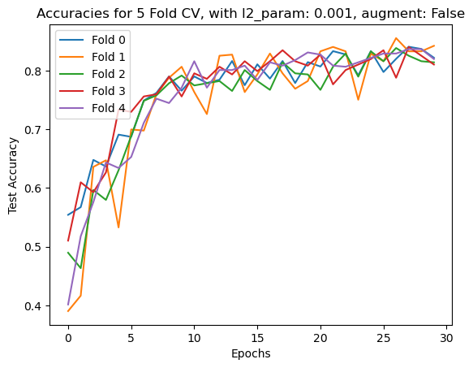

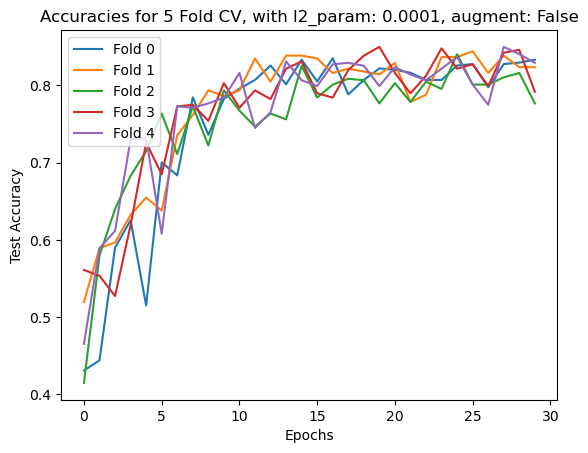

#### Visualization of the Training Convergence

```python
for m_key in model_history:
    accuracies = []
    losses = []
    for item in model_history.get(m_key):
        for key in item:
            if key == 'history':
                history = item.get('history')
                fold = item.get("fold")
                accuracies.append(history.history['val_accuracy'])
                losses.append(history.history['val_loss'])
    avg_acc = np.average(np.array(accuracies), axis=0)
    avg_loss = np.average(np.array(losses), axis=0)
    line = plt.plot(avg_acc, label=m_key)
    plt.plot(avg_loss, c=line[0].get_color())

plt.ylim(0.4, 1)
plt.title(f"Validation Accuracies and Losses for {folds} Fold CV")
plt.ylabel("Validation Accuracy")
plt.xlabel("Epochs")
plt.legend(loc= 'lower right')
plt.show()
```

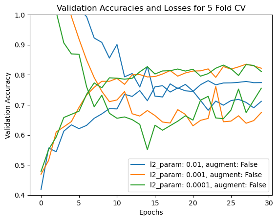

For simplification, the above lines for accuracy and loss use the same color and can be differentiated over the course of multiple epochs such as the loss comes from the top and gets lower while the accuracy comes from the bottom and rises higher.

### Update with GridSearchCV

Apparently, the first belief that the model parameters can't be optimized using GridSearchCV, was a misperception, because `model.get_params()` did not output the expected parameters... The way to go was to pass the `create_model_optimized({argument})` function as model parameter and then set the parameters of the param_grid like `model__{argument}`.

For a long time, we thought that the GridSearchCV implementation does not work with our data/model but as it turned out it was just because we didn't correctly split the tensorflow dataset into numpy arrays of images and labels. The issue was that we had to `unbatch()` the dataset first before splitting it. We've also created an [Issue on GitHub](https://github.com/scikit-learn/scikit-learn/issues/25825) because we were sure that there was a bug on sklearn's side.

Because of the huge effort, we left the custom Cross Validation implementation, but still provide a version using GridSearchCV, which is way more elegant.

During the time we thought that sklearn's GridSearchCV doesn't work correctly, we've also tried an alternative: [TensorCross](https://github.com/franneck94/TensorCross). By using TensorCross' GridSearchCV, we were able to pass the `tf.data.Dataset` directly which turned out to work correctly. At first, TensorCross was not compatible with tensorflow-macos, which we've also created a [GitHub Issue](https://github.com/franneck94/TensorCross/issues/45) for. That has been fixed very quickly so we were able to use the library. But after we've discovered that sklearn's GridSearchCV function does work correctly indeed, we've decided to kick out the TensorCross solution and only show the solution from sklearn's GridSearchCV.

```python
from sklearn.model_selection import GridSearchCV
from scikeras.wrappers import KerasClassifier

param_grid = dict(
    # last_layer_param=[256, 512, 1024],
    model__l2_param=[0.01, 0.001, 0.0001],
    model__augment=[False],
    # last_dropout_param=[0.2, 0.3, 0.4]
)
model = KerasClassifier(model=create_model_optimized)

print(model.get_params())

grid = GridSearchCV(estimator=model, param_grid=param_grid, cv=5)

grid_result = grid.fit(train_images, train_labels, epochs=30)
```

<i>We've intentionally cleared the output of the Cross Validation because it generated 60 pages of ouptput in the pdf.</i>

The GridSearchCV prints all the scores as well as the best params which is very convenient:

```python
grid_result.cv_results_
```

    {'mean_fit_time': array([106.8154943, 106.7972487, 107.7064878]),
     'std_fit_time': array([1.22298466, 1.2675996 , 0.57881809]),
     'mean_score_time': array([0.48121777, 1.01356459, 0.5630764 ]),
     'std_score_time': array([0.03374615, 0.96271606, 0.04472254]),
     'param_model__augment': masked_array(data=[False, False, False],
                  mask=[False, False, False],
            fill_value='?',
                 dtype=object),
     'param_model__l2_param': masked_array(data=[0.01, 0.001, 0.0001],
                  mask=[False, False, False],
            fill_value='?',
                 dtype=object),
     'params': [{'model__augment': False, 'model__l2_param': 0.01},
      {'model__augment': False, 'model__l2_param': 0.001},
      {'model__augment': False, 'model__l2_param': 0.0001}],
     'split0_test_score': array([0.77715356, 0.82209738, 0.81273408]),
     'split1_test_score': array([0.77110694, 0.77673546, 0.8217636 ]),
     'split2_test_score': array([0.76360225, 0.77485929, 0.80487805]),
     'split3_test_score': array([0.77485929, 0.80675422, 0.81613508]),
     'split4_test_score': array([0.78424015, 0.84615385, 0.77298311]),
     'mean_test_score': array([0.77419244, 0.80532004, 0.80569879]),
     'std_test_score': array([0.00680943, 0.02718776, 0.01724807]),
     'rank_test_score': array([3, 2, 1], dtype=int32)}

```python
grid_result.best_params_
```

    {'model__augment': False, 'model__l2_param': 0.0001}

The summary of the GridSearchCV outputs also the same result as the custom KFold Cross Validation implementation - l2=0.0001 is the best parameter for the optimized model. We've discovered that all three Cross Validation methods, the custom, the sklearn's GridSearchCV and the TensorCross' GridSearchCV, all found l2=0.0001 to be the best l2 regularization parameter. This was also true over multiple runs so these results are certainly significant.

## Training the Model

We are now training the model directly with data augmentation to make predictions on the test data and to intereprete its performance.

```python
model_optimized = create_model_optimized(augment=True, weight_factor=2)
model_optimized.summary()
```

    Found 2666 files belonging to 5 classes.
    Using 2133 files for training.
    Found 2666 files belonging to 5 classes.
    Using 533 files for validation.
    Found 2499 files belonging to 5 classes.
    Model: "sequential_34"
    _________________________________________________________________
     Layer (type)                Output Shape              Param #
    =================================================================
     sequential (Sequential)     (None, 150, 150, 3)       0

     batch_normalization_31 (Bat  (None, 150, 150, 3)      12
     chNormalization)

     conv2d_165 (Conv2D)         (None, 150, 150, 64)      1792

     max_pooling2d_165 (MaxPooli  (None, 75, 75, 64)       0
     ng2D)

     dropout_155 (Dropout)       (None, 75, 75, 64)        0

     conv2d_166 (Conv2D)         (None, 75, 75, 128)       73856

     max_pooling2d_166 (MaxPooli  (None, 37, 37, 128)      0
     ng2D)

     dropout_156 (Dropout)       (None, 37, 37, 128)       0

     conv2d_167 (Conv2D)         (None, 37, 37, 256)       295168

     max_pooling2d_167 (MaxPooli  (None, 18, 18, 256)      0
     ng2D)

     dropout_157 (Dropout)       (None, 18, 18, 256)       0

     conv2d_168 (Conv2D)         (None, 18, 18, 512)       1180160

     max_pooling2d_168 (MaxPooli  (None, 9, 9, 512)        0
     ng2D)

     dropout_158 (Dropout)       (None, 9, 9, 512)         0

     conv2d_169 (Conv2D)         (None, 9, 9, 1024)        4719616

     max_pooling2d_169 (MaxPooli  (None, 4, 4, 1024)       0
     ng2D)

     dropout_159 (Dropout)       (None, 4, 4, 1024)        0

     flatten_33 (Flatten)        (None, 16384)             0

     dense_66 (Dense)            (None, 256)               4194560

     dense_67 (Dense)            (None, 5)                 1285

    =================================================================
    Total params: 10,466,449
    Trainable params: 10,466,443
    Non-trainable params: 6
    _________________________________________________________________

```python
history = model_optimized.fit(train_ds, validation_data=val_ds, epochs=50)
```

    Epoch 1/50


    2023-03-17 13:38:01.730401: I tensorflow/core/grappler/optimizers/custom_graph_optimizer_registry.cc:113] Plugin optimizer for device_type GPU is enabled.


    134/134 [==============================] - ETA: 0s - loss: 2.3965 - accuracy: 0.3919

    2023-03-17 13:38:22.712039: I tensorflow/core/grappler/optimizers/custom_graph_optimizer_registry.cc:113] Plugin optimizer for device_type GPU is enabled.


    134/134 [==============================] - 23s 152ms/step - loss: 2.3965 - accuracy: 0.3919 - val_loss: 1.6807 - val_accuracy: 0.5497
    Epoch 2/50
    134/134 [==============================] - 16s 122ms/step - loss: 1.5764 - accuracy: 0.5373 - val_loss: 1.3333 - val_accuracy: 0.5929
    Epoch 3/50
    134/134 [==============================] - 16s 121ms/step - loss: 1.3037 - accuracy: 0.5823 - val_loss: 1.1786 - val_accuracy: 0.6248
    Epoch 4/50
    134/134 [==============================] - 16s 123ms/step - loss: 1.1532 - accuracy: 0.6160 - val_loss: 1.0931 - val_accuracy: 0.6623
    Epoch 5/50
    134/134 [==============================] - 16s 120ms/step - loss: 1.1109 - accuracy: 0.6245 - val_loss: 1.1293 - val_accuracy: 0.6004
    Epoch 6/50
    134/134 [==============================] - 17s 128ms/step - loss: 0.9926 - accuracy: 0.6606 - val_loss: 0.9041 - val_accuracy: 0.7054
    Epoch 7/50
    134/134 [==============================] - 17s 126ms/step - loss: 0.9260 - accuracy: 0.6793 - val_loss: 0.8908 - val_accuracy: 0.7186
    Epoch 8/50
    134/134 [==============================] - 16s 120ms/step - loss: 0.8795 - accuracy: 0.6939 - val_loss: 0.7994 - val_accuracy: 0.7355
    Epoch 9/50
    134/134 [==============================] - 16s 118ms/step - loss: 0.8520 - accuracy: 0.7032 - val_loss: 0.9447 - val_accuracy: 0.6660
    Epoch 10/50
    134/134 [==============================] - 16s 121ms/step - loss: 0.8156 - accuracy: 0.7215 - val_loss: 0.8318 - val_accuracy: 0.7373
    Epoch 11/50
    134/134 [==============================] - 16s 120ms/step - loss: 0.8492 - accuracy: 0.7046 - val_loss: 0.7892 - val_accuracy: 0.7448
    Epoch 12/50
    134/134 [==============================] - 16s 118ms/step - loss: 0.7872 - accuracy: 0.7328 - val_loss: 0.7305 - val_accuracy: 0.7542
    Epoch 13/50
    134/134 [==============================] - 16s 121ms/step - loss: 0.8078 - accuracy: 0.7243 - val_loss: 0.8215 - val_accuracy: 0.7186
    Epoch 14/50
    134/134 [==============================] - 16s 120ms/step - loss: 0.7789 - accuracy: 0.7412 - val_loss: 0.7092 - val_accuracy: 0.7786
    Epoch 15/50
    134/134 [==============================] - 16s 120ms/step - loss: 0.7192 - accuracy: 0.7623 - val_loss: 0.7277 - val_accuracy: 0.7711
    Epoch 16/50
    134/134 [==============================] - 16s 117ms/step - loss: 0.7265 - accuracy: 0.7632 - val_loss: 0.8733 - val_accuracy: 0.7073
    Epoch 17/50
    134/134 [==============================] - 16s 119ms/step - loss: 0.7182 - accuracy: 0.7614 - val_loss: 0.6767 - val_accuracy: 0.7861
    Epoch 18/50
    134/134 [==============================] - 16s 120ms/step - loss: 0.7143 - accuracy: 0.7637 - val_loss: 0.7955 - val_accuracy: 0.7373
    Epoch 19/50
    134/134 [==============================] - 16s 122ms/step - loss: 0.6985 - accuracy: 0.7712 - val_loss: 0.6787 - val_accuracy: 0.7767
    Epoch 20/50
    134/134 [==============================] - 16s 121ms/step - loss: 0.6740 - accuracy: 0.7656 - val_loss: 0.7186 - val_accuracy: 0.7430
    Epoch 21/50
    134/134 [==============================] - 16s 121ms/step - loss: 0.6604 - accuracy: 0.7797 - val_loss: 0.6605 - val_accuracy: 0.8011
    Epoch 22/50
    134/134 [==============================] - 16s 119ms/step - loss: 0.6614 - accuracy: 0.7815 - val_loss: 0.6464 - val_accuracy: 0.7974
    Epoch 23/50
    134/134 [==============================] - 16s 119ms/step - loss: 0.6629 - accuracy: 0.7820 - val_loss: 0.6510 - val_accuracy: 0.8086
    Epoch 24/50
    134/134 [==============================] - 16s 119ms/step - loss: 0.6726 - accuracy: 0.7787 - val_loss: 0.6963 - val_accuracy: 0.7842
    Epoch 25/50
    134/134 [==============================] - 16s 119ms/step - loss: 0.6514 - accuracy: 0.7890 - val_loss: 0.6562 - val_accuracy: 0.7880
    Epoch 26/50
    134/134 [==============================] - 16s 119ms/step - loss: 0.6252 - accuracy: 0.7923 - val_loss: 0.7060 - val_accuracy: 0.7711
    Epoch 27/50
    134/134 [==============================] - 16s 121ms/step - loss: 0.6662 - accuracy: 0.7759 - val_loss: 0.7603 - val_accuracy: 0.7674
    Epoch 28/50
    134/134 [==============================] - 16s 118ms/step - loss: 0.6331 - accuracy: 0.8003 - val_loss: 0.6923 - val_accuracy: 0.8011
    Epoch 29/50
    134/134 [==============================] - 16s 119ms/step - loss: 0.6032 - accuracy: 0.8054 - val_loss: 0.7842 - val_accuracy: 0.7411
    Epoch 30/50
    134/134 [==============================] - 16s 119ms/step - loss: 0.6086 - accuracy: 0.8040 - val_loss: 0.6629 - val_accuracy: 0.7992
    Epoch 31/50
    134/134 [==============================] - 16s 119ms/step - loss: 0.6375 - accuracy: 0.7956 - val_loss: 0.6225 - val_accuracy: 0.7974
    Epoch 32/50
    134/134 [==============================] - 16s 118ms/step - loss: 0.6237 - accuracy: 0.7970 - val_loss: 0.7387 - val_accuracy: 0.7486
    Epoch 33/50
    134/134 [==============================] - 16s 118ms/step - loss: 0.6242 - accuracy: 0.8036 - val_loss: 0.5937 - val_accuracy: 0.8180
    Epoch 34/50
    134/134 [==============================] - 16s 119ms/step - loss: 0.6217 - accuracy: 0.8026 - val_loss: 0.6055 - val_accuracy: 0.8199
    Epoch 35/50
    134/134 [==============================] - 16s 120ms/step - loss: 0.6210 - accuracy: 0.8083 - val_loss: 0.7583 - val_accuracy: 0.7805
    Epoch 36/50
    134/134 [==============================] - 16s 119ms/step - loss: 0.6202 - accuracy: 0.8026 - val_loss: 0.6469 - val_accuracy: 0.8105
    Epoch 37/50
    134/134 [==============================] - 16s 119ms/step - loss: 0.5954 - accuracy: 0.8186 - val_loss: 0.6248 - val_accuracy: 0.7974
    Epoch 38/50
    134/134 [==============================] - 16s 118ms/step - loss: 0.5753 - accuracy: 0.8172 - val_loss: 0.6029 - val_accuracy: 0.8199
    Epoch 39/50
    134/134 [==============================] - 16s 119ms/step - loss: 0.6007 - accuracy: 0.8172 - val_loss: 0.7081 - val_accuracy: 0.7861
    Epoch 40/50
    134/134 [==============================] - 16s 118ms/step - loss: 0.5777 - accuracy: 0.8195 - val_loss: 0.6357 - val_accuracy: 0.8086
    Epoch 41/50
    134/134 [==============================] - 16s 119ms/step - loss: 0.5822 - accuracy: 0.8195 - val_loss: 0.6144 - val_accuracy: 0.8311
    Epoch 42/50
    134/134 [==============================] - 16s 118ms/step - loss: 0.5776 - accuracy: 0.8153 - val_loss: 0.5792 - val_accuracy: 0.8405
    Epoch 43/50
    134/134 [==============================] - 16s 117ms/step - loss: 0.5661 - accuracy: 0.8237 - val_loss: 0.6186 - val_accuracy: 0.8124
    Epoch 44/50
    134/134 [==============================] - 16s 119ms/step - loss: 0.5706 - accuracy: 0.8261 - val_loss: 0.6132 - val_accuracy: 0.8311
    Epoch 45/50
    134/134 [==============================] - 16s 119ms/step - loss: 0.5887 - accuracy: 0.8125 - val_loss: 0.6502 - val_accuracy: 0.7974
    Epoch 46/50
    134/134 [==============================] - 16s 118ms/step - loss: 0.5658 - accuracy: 0.8312 - val_loss: 0.6077 - val_accuracy: 0.8218
    Epoch 47/50
    134/134 [==============================] - 16s 119ms/step - loss: 0.5286 - accuracy: 0.8401 - val_loss: 0.6519 - val_accuracy: 0.7842
    Epoch 48/50
    134/134 [==============================] - 16s 118ms/step - loss: 0.5631 - accuracy: 0.8270 - val_loss: 0.7047 - val_accuracy: 0.7936
    Epoch 49/50
    134/134 [==============================] - 16s 118ms/step - loss: 0.5861 - accuracy: 0.8209 - val_loss: 0.6443 - val_accuracy: 0.8143
    Epoch 50/50
    134/134 [==============================] - 16s 117ms/step - loss: 0.5796 - accuracy: 0.8200 - val_loss: 0.6489 - val_accuracy: 0.8105

```python
visualize_results(history)
```

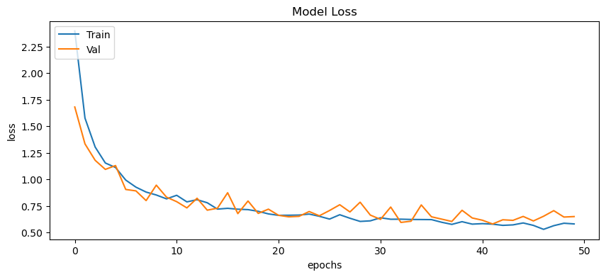

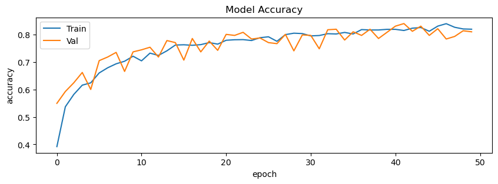

The diagram may look very volatile, but keep in mind the y-axis is scaled.

```python
model_optimized.evaluate(test_ds)
```

    157/157 [==============================] - 4s 22ms/step - loss: 0.6600 - accuracy: 0.8055


    [0.6600058674812317, 0.8055222034454346]

```python
show_images_with_predictions(model_optimized)
```

    1/1 [==============================] - 0s 23ms/step
    1/1 [==============================] - 0s 69ms/step
    1/1 [==============================] - 0s 10ms/step
    1/1 [==============================] - 0s 11ms/step
    1/1 [==============================] - 0s 10ms/step
    1/1 [==============================] - 0s 10ms/step
    1/1 [==============================] - 0s 11ms/step
    1/1 [==============================] - 0s 10ms/step
    1/1 [==============================] - 0s 10ms/step
    1/1 [==============================] - 0s 10ms/step
    1/1 [==============================] - 0s 10ms/step
    1/1 [==============================] - 0s 10ms/step

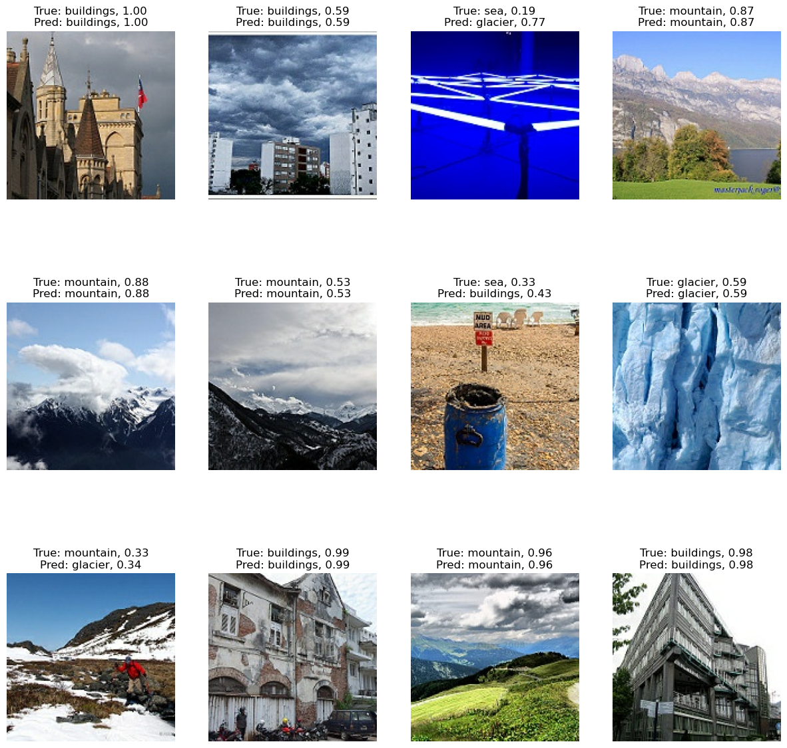

## Confusion Matrix

```python
true_labels, pred_labels = show_confusion_matrix(model_optimized)
```

    1/1 [==============================] - 0s 278ms/step
    1/1 [==============================] - 0s 62ms/step
    1/1 [==============================] - 0s 12ms/step
    1/1 [==============================] - 0s 11ms/step
    1/1 [==============================] - 0s 11ms/step
    1/1 [==============================] - 0s 10ms/step
    1/1 [==============================] - 0s 10ms/step
    1/1 [==============================] - 0s 10ms/step
    1/1 [==============================] - 0s 10ms/step
    1/1 [==============================] - 0s 11ms/step
    1/1 [==============================] - 0s 11ms/step
    1/1 [==============================] - 0s 11ms/step
    1/1 [==============================] - 0s 11ms/step
    1/1 [==============================] - 0s 10ms/step
    1/1 [==============================] - 0s 11ms/step
    1/1 [==============================] - 0s 11ms/step
    1/1 [==============================] - 0s 10ms/step
    1/1 [==============================] - 0s 11ms/step
    1/1 [==============================] - 0s 11ms/step
    1/1 [==============================] - 0s 10ms/step
    1/1 [==============================] - 0s 11ms/step
    1/1 [==============================] - 0s 10ms/step
    1/1 [==============================] - 0s 10ms/step
    1/1 [==============================] - 0s 11ms/step
    1/1 [==============================] - 0s 11ms/step
    1/1 [==============================] - 0s 10ms/step
    1/1 [==============================] - 0s 10ms/step
    1/1 [==============================] - 0s 11ms/step
    1/1 [==============================] - 0s 10ms/step
    1/1 [==============================] - 0s 10ms/step
    1/1 [==============================] - 0s 10ms/step
    1/1 [==============================] - 0s 10ms/step
    1/1 [==============================] - 0s 10ms/step
    1/1 [==============================] - 0s 10ms/step
    1/1 [==============================] - 0s 10ms/step
    1/1 [==============================] - 0s 10ms/step
    1/1 [==============================] - 0s 10ms/step
    1/1 [==============================] - 0s 11ms/step
    1/1 [==============================] - 0s 11ms/step
    1/1 [==============================] - 0s 10ms/step
    1/1 [==============================] - 0s 10ms/step
    1/1 [==============================] - 0s 10ms/step
    1/1 [==============================] - 0s 10ms/step
    1/1 [==============================] - 0s 11ms/step
    1/1 [==============================] - 0s 10ms/step
    1/1 [==============================] - 0s 10ms/step
    1/1 [==============================] - 0s 11ms/step
    1/1 [==============================] - 0s 10ms/step
    1/1 [==============================] - 0s 10ms/step
    1/1 [==============================] - 0s 10ms/step
    1/1 [==============================] - 0s 11ms/step
    1/1 [==============================] - 0s 10ms/step
    1/1 [==============================] - 0s 10ms/step
    1/1 [==============================] - 0s 10ms/step
    1/1 [==============================] - 0s 10ms/step
    1/1 [==============================] - 0s 10ms/step
    1/1 [==============================] - 0s 10ms/step
    1/1 [==============================] - 0s 10ms/step
    1/1 [==============================] - 0s 10ms/step
    1/1 [==============================] - 0s 10ms/step
    1/1 [==============================] - 0s 10ms/step
    1/1 [==============================] - 0s 10ms/step
    1/1 [==============================] - 0s 10ms/step
    1/1 [==============================] - 0s 10ms/step
    1/1 [==============================] - 0s 11ms/step
    1/1 [==============================] - 0s 10ms/step
    1/1 [==============================] - 0s 10ms/step
    1/1 [==============================] - 0s 10ms/step
    1/1 [==============================] - 0s 10ms/step
    1/1 [==============================] - 0s 10ms/step
    1/1 [==============================] - 0s 10ms/step
    1/1 [==============================] - 0s 10ms/step
    1/1 [==============================] - 0s 10ms/step
    1/1 [==============================] - 0s 10ms/step
    1/1 [==============================] - 0s 11ms/step
    1/1 [==============================] - 0s 11ms/step
    1/1 [==============================] - 0s 11ms/step
    1/1 [==============================] - 0s 11ms/step
    1/1 [==============================] - 0s 11ms/step
    1/1 [==============================] - 0s 10ms/step
    1/1 [==============================] - 0s 10ms/step
    1/1 [==============================] - 0s 11ms/step
    1/1 [==============================] - 0s 10ms/step
    1/1 [==============================] - 0s 10ms/step
    1/1 [==============================] - 0s 10ms/step
    1/1 [==============================] - 0s 10ms/step
    1/1 [==============================] - 0s 10ms/step
    1/1 [==============================] - 0s 10ms/step
    1/1 [==============================] - 0s 10ms/step
    1/1 [==============================] - 0s 10ms/step
    1/1 [==============================] - 0s 10ms/step
    1/1 [==============================] - 0s 10ms/step
    1/1 [==============================] - 0s 10ms/step
    1/1 [==============================] - 0s 10ms/step
    1/1 [==============================] - 0s 11ms/step
    1/1 [==============================] - 0s 10ms/step
    1/1 [==============================] - 0s 10ms/step
    1/1 [==============================] - 0s 11ms/step
    1/1 [==============================] - 0s 10ms/step
    1/1 [==============================] - 0s 10ms/step
    1/1 [==============================] - 0s 10ms/step
    1/1 [==============================] - 0s 10ms/step
    1/1 [==============================] - 0s 10ms/step
    1/1 [==============================] - 0s 10ms/step
    1/1 [==============================] - 0s 9ms/step
    1/1 [==============================] - 0s 10ms/step
    1/1 [==============================] - 0s 11ms/step
    1/1 [==============================] - 0s 10ms/step
    1/1 [==============================] - 0s 10ms/step
    1/1 [==============================] - 0s 11ms/step
    1/1 [==============================] - 0s 10ms/step
    1/1 [==============================] - 0s 10ms/step
    1/1 [==============================] - 0s 10ms/step
    1/1 [==============================] - 0s 11ms/step
    1/1 [==============================] - 0s 11ms/step
    1/1 [==============================] - 0s 10ms/step
    1/1 [==============================] - 0s 11ms/step
    1/1 [==============================] - 0s 11ms/step
    1/1 [==============================] - 0s 10ms/step
    1/1 [==============================] - 0s 10ms/step
    1/1 [==============================] - 0s 10ms/step
    1/1 [==============================] - 0s 15ms/step
    1/1 [==============================] - 0s 16ms/step
    1/1 [==============================] - 0s 11ms/step
    1/1 [==============================] - 0s 11ms/step
    1/1 [==============================] - 0s 11ms/step
    1/1 [==============================] - 0s 11ms/step
    1/1 [==============================] - 0s 10ms/step
    1/1 [==============================] - 0s 11ms/step
    1/1 [==============================] - 0s 11ms/step
    1/1 [==============================] - 0s 11ms/step
    1/1 [==============================] - 0s 10ms/step
    1/1 [==============================] - 0s 10ms/step
    1/1 [==============================] - 0s 11ms/step
    1/1 [==============================] - 0s 11ms/step
    1/1 [==============================] - 0s 10ms/step
    1/1 [==============================] - 0s 11ms/step
    1/1 [==============================] - 0s 11ms/step
    1/1 [==============================] - 0s 11ms/step
    1/1 [==============================] - 0s 11ms/step
    1/1 [==============================] - 0s 10ms/step
    1/1 [==============================] - 0s 10ms/step
    1/1 [==============================] - 0s 11ms/step
    1/1 [==============================] - 0s 10ms/step
    1/1 [==============================] - 0s 11ms/step
    1/1 [==============================] - 0s 10ms/step
    1/1 [==============================] - 0s 10ms/step
    1/1 [==============================] - 0s 11ms/step
    1/1 [==============================] - 0s 10ms/step
    1/1 [==============================] - 0s 10ms/step
    1/1 [==============================] - 0s 11ms/step
    1/1 [==============================] - 0s 10ms/step
    1/1 [==============================] - 0s 10ms/step
    1/1 [==============================] - 0s 10ms/step
    1/1 [==============================] - 0s 11ms/step
    1/1 [==============================] - 0s 10ms/step
    1/1 [==============================] - 0s 217ms/step

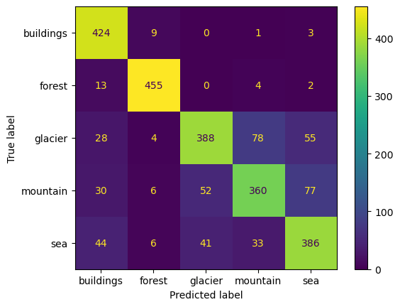

As from the above Confusion Matrix, the predictions for the class forest and buildings are very accurate while predictions for glacier and mountain get confused the most often. A possible reason for this is that some images containing snow and are labeled as mountain while others are being labeled as glacier. In one example, the predictions for mountain and glacier are really close together where an ensemble method of multiple models with other weaknesses could help to improve the predictions:

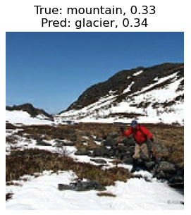

## Classification Report

```python
print('Classification Report:\n', metrics.classification_report(y_true=true_labels, y_pred=pred_labels))
```

    Classification Report:
                   precision    recall  f1-score   support

               0       0.79      0.97      0.87       437
               1       0.95      0.96      0.95       474
               2       0.81      0.70      0.75       553
               3       0.76      0.69      0.72       525
               4       0.74      0.76      0.75       510

        accuracy                           0.81      2499
       macro avg       0.81      0.81      0.81      2499
    weighted avg       0.81      0.81      0.80      2499

From the classification report we can conclude that the optimized model has the overall best score for unseen data.

# Conclusion

This project was exciting as it was challenging. It made us really try out numerous ways on how to tweak both performance in the sense of speed and of model accuracy. It is interesting how a small change can have a huge impact on the model's learning behavior. We've also extensively dealt with the over- and underfitting effects which consolidated our understanding on how and when to use regularization and generalization optimizations.

In summary, creating a model with tensorflow is very easy and convenient but creating a performant model can be an overwhelming and time consuming process that can be frustrating at some point. But seeing the results of a successful improvement, on the other hand, is very satisfactory. The biggest difficulty in our opinion is to not loose the overview of the data handling.

# Outlook

As a wrap-up we'd like to give a short outlook on what could be further steps to improve the model or to take the model into production.

## Export and Reuse

Tensorflow allows to export the weights of a trained model. In this way a new model can be initialized using the saved weights and can be used directly to make predictions on unseen data. This would be the method we'd use if we'd take this model to some productive use.

## Deployment of the model

Furthermore, it would be possible to implement the model on a cloud-based platform or server for productive purposes. This would require making an API that can handle requests and return predictions, while also constructing the essential infrastructure required to handle the computational power.

## Further Optimizations

The parameter optimizations we've made with Cross Validation are valid but would need some improvements for productive models. For example it would be necessary to optimize with multiple parameter changes e.g. simulatenously train for the optimal parameter of batch size, l2 parameter, dropout values, etc. We've also noticed that the results are not reproducible which implies that we would need to train more folds than 5 to obtain more stable results.

Even though it wasn't a competition to create the most accurate model, we tried to find optimal parameters to increase the accuracy and minimize the loss. We were stuck at 80% to 85% accuracy and we've learned that the last 15% were the most difficult to achieve. In the beginning it was way easier to get from 60% to 70% by tuning a single parameter or adding a new layer to the model. But for the last 15% there are so many factors that can be improved in order to obtain an "optimal" model.

To overcome this difficulty of creating the "optimal" model (which we know isn't the goal), we could train multiple models with subsets of the dataset and then apply some ensemble algorithm to find the correct predictions. Furthermore, it is crucial that we don't have wrong labeled data in the dataset since it would confuse the model a lot so manual data preprocessing would be an important step for productive use-cases.

## General Outlook

We are curious to see how machine learning will change the way everyone works and what impact it might have on our lives. In this example, how classifying images may help computervision thrive. We are delighted to be able to take an AI class and therefore learn more about AI as well as create and train our own models during such exciting times.
